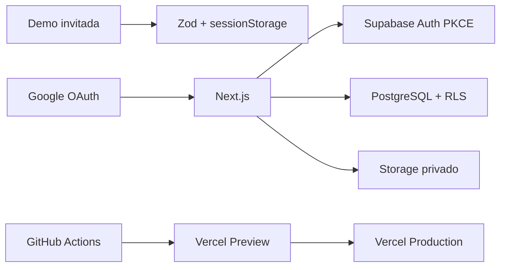

# Plataforma de gestión

[](https://github.com/antoniojesusdelgado/management-platform-demo/actions/workflows/ci.yml)

Aplicación SaaS modular de demostración para organizar proyectos, tareas,
vacaciones, incidencias, tesorería, nóminas agregadas, personas y analítica.

**Demo pública:** [plataformagestion.app](https://plataformagestion.app)

> **English summary:** Independent full-stack management platform demo with a
> session-only guest mode, isolated Google OAuth workspaces, PostgreSQL Row
> Level Security, deterministic fictitious data and end-to-end validation.

## Funciones principales

- Inicio con prioridades, agenda y actividad reciente.
- Vacaciones con solicitudes, aprobación, calendario y solapamientos.
- Analítica dinámica por periodo, proyecto, equipo, responsable y servicio.
- Proyectos con responsables, progreso, salud e historial.
- Tareas en Kanban, lista y bandeja, con dependencias y comentarios.
- Incidencias con prioridad, SLA, causa, resolución y acciones correctivas.
- Tesorería con importaciones, conciliación y excepciones.
- Nóminas exclusivamente agregadas y participantes sin importes individuales.
- Personal con directorio, modalidades contractuales y organigrama.
- Novedades como cronología pública y Configuración parametrizable.

## Arquitectura resumida



La experiencia invitada y la autenticada mantienen repositorios de datos
independientes. Las lecturas autenticadas usan Server Components; las
mutaciones usan Server Actions/RPC y RLS como última barrera.

## Datos ficticios

Todo el contenido operativo se genera localmente de forma determinista. No se
incluyen datos, documentos, contactos, cuentas, salarios individuales,
pantallas ni procesos internos de organizaciones reales. Los conectores son
neutrales y no contactan servicios bancarios, laborales o de terceros.

Consulta [Procedencia de los datos](docs/DATA-PROVENANCE.md) y el
[caso de estudio técnico](docs/TECHNICAL-CASE-STUDY.md).

## Desarrollo local

Requisitos: Bun 1.3.14 y, para la base de datos local, Docker Desktop.

```powershell
git clone https://github.com/antoniojesusdelgado/management-platform-demo.git
Set-Location management-platform-demo
bun install --frozen-lockfile
Copy-Item .env.example .env.local
bun run dev
```

Rutas:

- `http://localhost:3000/` — acceso público.
- `http://localhost:3000/demo/embed` — demo invitada.
- `http://localhost:3000/app/inicio` — aplicación autenticada.

Google OAuth requiere un proyecto Supabase independiente configurado según la
[guía de despliegue](docs/DEPLOYMENT.md).

## Validación

```powershell
bun run lint
bun run typecheck
bun run test
bun run content:validate
bun run security:public-data
bun run demo:data:generate
bun run demo:data:validate
bun run demo:data:report
bun audit --audit-level=high
bun run build
bun run e2e
bun run e2e:a11y
git diff --check
```

Con Docker:

```powershell
bunx supabase start
bunx supabase db reset
bunx supabase test db
bunx supabase db lint --local --level warning --fail-on error
bunx supabase db advisors --local --type all
bunx supabase gen types --lang typescript --local
```

La versión `1.3.0` añade tema `light | dark | system`, preferencias de
contraste, densidad y movimiento, códigos estables de servicio para Analítica
y Scenario V7 incremental hasta ayer en `Europe/Madrid`. La RPC autenticada
solo anexa el intervalo pendiente, usa bloqueo por organización y conserva
filas operativas existentes.

## Variables

| Variable | Exposición | Uso |
| --- | --- | --- |
| `NEXT_PUBLIC_APP_URL` | Navegador | Origen canónico |
| `NEXT_PUBLIC_VERCEL_URL` | Navegador | Origen Preview |
| `NEXT_PUBLIC_SUPABASE_URL` | Navegador | Proyecto Supabase |
| `NEXT_PUBLIC_SUPABASE_PUBLISHABLE_KEY` | Navegador | Clave publicable |
| `PORTFOLIO_ORIGIN` | Servidor/build | Origen permitido para iframe |
| `NEXT_PUBLIC_PRIVACY_CONTACT_EMAIL` | Navegador | Contacto legal público |

No se necesita una clave de OpenAI en runtime.

## Documentación

- [Caso de estudio técnico](docs/TECHNICAL-CASE-STUDY.md)
- [Arquitectura](docs/ARCHITECTURE.md)
- [Mapa de procesos](docs/PROCESS-MAPS.md)
- [Permisos y RLS](docs/PERMISSIONS.md)
- [Procedencia de los datos](docs/DATA-PROVENANCE.md)
- [Despliegue](docs/DEPLOYMENT.md)
- [Seguridad](SECURITY.md)
- [Licencias de dependencias](docs/THIRD-PARTY-LICENSES.md)

## Licencia

Copyright © 2026 Antonio Jesús Delgado Briones. Todos los derechos reservados.
Consulta [LICENSE](LICENSE). Las dependencias conservan sus licencias propias.
