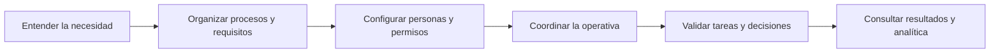
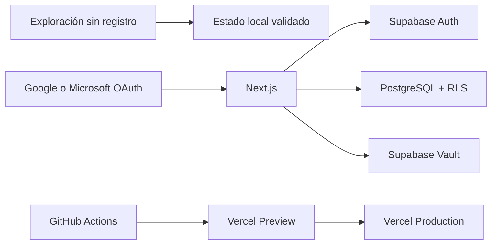

# Plataforma de gestión

**Todo el trabajo, en un solo lugar**

[](https://github.com/antoniojesusdelgado/management-platform/releases/latest)
[](https://github.com/antoniojesusdelgado/management-platform/actions/workflows/ci.yml)
[](https://github.com/antoniojesusdelgado/management-platform/actions/workflows/codeql.yml)


Plataforma modular para centralizar personas, proyectos, tareas, incidencias, administración y analítica en un espacio común. Puede explorarse sin registro o utilizarse mediante Google y Microsoft OAuth en organizaciones aisladas por permisos.

[Abrir la plataforma](https://plataformagestion.app) · [Ver el caso en el portfolio](https://antoniodelgado.tech/proyectos/plataforma-de-gestion) · [Consultar la última versión](https://github.com/antoniojesusdelgado/management-platform/releases/latest)

[](https://plataformagestion.app)

## Visión general

| | |
| --- | --- |
| **Necesidad** | Centralizar una operativa distribuida entre hojas de cálculo y diferentes herramientas. |
| **Aportación** | Análisis de procesos, toma de requisitos, definición funcional, desarrollo, pruebas, implantación y despliegue. |
| **Solución** | Una plataforma modular que conecta trabajo, personas, gestión y analítica con permisos por organización. |
| **Evidencia** | Aplicación pública recorrible, caso profesional, código, documentación, releases y comprobaciones automatizadas. |

El proyecto original responde a una necesidad operativa real de Fundación Cibervoluntarios. Este repositorio contiene una implementación pública posterior, independiente y técnicamente aislada; no es el sistema interno de la Fundación ni implica patrocinio o respaldo.

## Aportación profesional

- **Análisis funcional:** procesos, requisitos, reglas de negocio, permisos y criterios de aceptación para once módulos conectados.
- **Coordinación de la solución:** alineación entre necesidades operativas, diseño funcional, implementación y puesta en producción.
- **Business Intelligence:** indicadores, filtros, comparaciones y vistas de seguimiento dentro del mismo entorno de trabajo.
- **Validación:** pruebas funcionales, UAT, accesibilidad, seguridad, aislamiento de datos y revisión previa a cada publicación.
- **Evolución del producto:** entregas incrementales, documentación trazable y mejora continua a partir del uso real.

## Capacidades principales

- Inicio operativo con prioridades, agenda, actividad y bandeja personal.
- Proyectos, tareas, incidencias, vacaciones y planificación de capacidad.
- Directorio, equipos, organigrama, permisos y aislamiento por organización.
- Tesorería agregada, ciclos de nómina y seguimiento administrativo sin datos reales.
- Analítica con filtros, comparaciones, vistas guardadas y exportaciones.
- Automatizaciones controladas, plantillas, recurrencias y notificaciones.
- Búsqueda global y diseño adaptable con tema claro u oscuro.
- Recorrido público con información sintética y acceso autenticado con Google o Microsoft.

## Recorrido funcional



El objetivo no es reunir módulos aislados, sino conservar el contexto entre personas, trabajo, datos y decisiones.

## Arquitectura



El modo de exploración funciona en el navegador y no escribe en Supabase. El área autenticada vuelve a comprobar sesión, organización y permisos en el servidor; PostgreSQL repite el aislamiento mediante Row Level Security.

Consulta [Arquitectura](docs/ARCHITECTURE.md), [Permisos](docs/PERMISSIONS.md) y [Seguridad](SECURITY.md) para el detalle técnico.

## Tecnologías

| Capa | Tecnologías |
| --- | --- |
| Interfaz | Next.js, React, TypeScript y Tailwind CSS |
| Datos | Supabase, PostgreSQL, Row Level Security y Zod |
| Identidad | Google OAuth, Microsoft OAuth y permisos por organización |
| Calidad | Bun, Playwright, Axe, GitHub Actions y CodeQL |
| Publicación | Vercel, Preview protegida, dominio propio y HTTPS |

## Estructura del repositorio

```text
src/app/          Rutas, acciones de servidor y páginas
src/components/   Módulos y componentes de la experiencia
src/domain/       Reglas de negocio y contratos funcionales
src/lib/          Autenticación, autorización y acceso a datos
supabase/         Migraciones, configuración y pruebas de base de datos
tests/            Pruebas de navegador y accesibilidad
docs/             Arquitectura, procesos, seguridad y operación
```

## Datos, privacidad y transparencia

El modo público utiliza exclusivamente información sintética y no contiene datos, documentos, credenciales, reglas internas ni conexiones de Fundación Cibervoluntarios o de otra organización real.

Las integraciones son opcionales, los secretos se procesan únicamente en servidor y las cuentas disponen de un flujo de supresión. La analítica solo se carga después de una aceptación expresa.

El desarrollo se ha realizado con asistencia de Inteligencia Artificial bajo dirección, revisión y validación humana. La aplicación desplegada no llama a modelos de OpenAI ni envía datos a OpenAI. El alcance completo está documentado en [Transparencia y privacidad](docs/AI-TRANSPARENCY-AND-PRIVACY.md).

## Desarrollo local

Requisitos: Bun 1.3.14 y, para ejecutar Supabase local, Docker Desktop.

```powershell
git clone https://github.com/antoniojesusdelgado/management-platform.git
Set-Location management-platform
bun install --frozen-lockfile
Copy-Item .env.example .env.local
bun run dev
```

La configuración completa de Supabase, OAuth y Vercel se encuentra en [Despliegue](docs/DEPLOYMENT.md).

## Validación

```powershell
bun run lint
bun run typecheck
bun run test
bun run content:validate
bun run security:public-data
bun run security:secrets
bun run scenario:data:validate
bun audit --audit-level=high
bun run build
bun run e2e
bun run e2e:a11y
git diff --check
```

Las comprobaciones de base de datos requieren Docker y se documentan en la guía de despliegue.

## Documentación

| Documento | Contenido |
| --- | --- |
| [Caso técnico](docs/TECHNICAL-CASE-STUDY.md) | Decisiones de producto, arquitectura y validación |
| [Arquitectura](docs/ARCHITECTURE.md) | Componentes, límites y flujos principales |
| [Mapa de procesos](docs/PROCESS-MAPS.md) | Recorridos y reglas funcionales |
| [Permisos](docs/PERMISSIONS.md) | Roles, autorización y aislamiento |
| [Procedencia de los datos](docs/DATA-PROVENANCE.md) | Origen sintético y controles de publicación |
| [Despliegue](docs/DEPLOYMENT.md) | Configuración local, OAuth, Supabase y Vercel |
| [Seguridad](SECURITY.md) | Modelo de seguridad y comunicación responsable |

## Derechos

Copyright © 2026 Antonio Jesús Delgado Briones. Todos los derechos reservados.

El repositorio es público para consulta profesional, pero no concede permiso de uso, modificación o redistribución. Consulta [LICENSE](LICENSE) y [THIRD-PARTY-LICENSES.md](docs/THIRD-PARTY-LICENSES.md).
