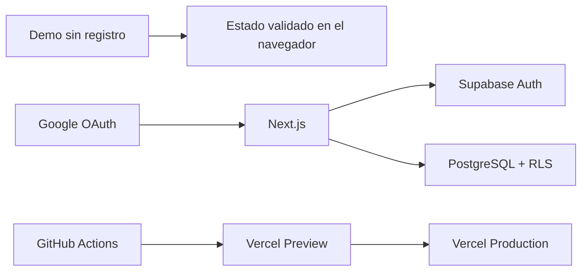

# Plataforma de gestión

> v1.8.2 mejora el acceso, la privacidad y la seguridad: permisos OAuth progresivos, analítica opcional y supresión de cuenta desde el perfil.

[](https://github.com/antoniojesusdelgado/management-platform-demo/actions/workflows/ci.yml)
[](https://github.com/antoniojesusdelgado/management-platform-demo/releases/latest)

Una réplica técnica pública de una plataforma de gestión interna que reúne
personas, proyectos, tareas, vacaciones, incidencias, tesorería, nóminas y
analítica en un mismo espacio.

El proyecto original nació de una necesidad operativa de Fundación
Cibervoluntarios: centralizar procesos que estaban repartidos entre hojas de
cálculo y herramientas externas. Antonio Delgado realizó el análisis de
procesos, la toma de requisitos, el desarrollo, las pruebas, la implantación y
el despliegue de la solución utilizada por la Fundación.

Este repositorio contiene una réplica posterior y técnicamente aislada. No es
el sistema interno de la Fundación y no incluye su código, datos, documentos,
credenciales, reglas internas ni conexiones. La mención de la organización
explica el origen funcional del proyecto y no implica patrocinio o respaldo del
repositorio público.

**Demo pública:** [plataformagestion.app](https://plataformagestion.app)

La réplica puede recorrerse sin registro o mediante Google o Microsoft OAuth.
Las cuentas autenticadas pueden crear empresas, aceptar invitaciones y cambiar
entre organizaciones aisladas. La demo pública utiliza exclusivamente datos
ficticios.

## Qué se puede explorar

- Un panel de inicio con prioridades, agenda y actividad reciente.
- Solicitudes y aprobaciones de vacaciones con calendario de ausencias.
- Proyectos y tareas en vistas Kanban, lista y bandeja personal.
- Incidencias con prioridad, compromisos de atención y seguimiento.
- Tesorería, conciliación y ciclos de nómina con información agregada.
- Directorio paginado, filtros combinables y organigrama interactivo por equipos.
- Analítica con filtros cruzados, lecturas guiadas, detalle contextual, comparaciones y vistas guardadas.
- Búsqueda global de personas, proyectos, tareas e incidencias con `Ctrl/Cmd+K`.
- Bandeja personal con tareas, aprobaciones, compromisos de atención y avisos operativos.
- Automatizaciones controladas, plantillas y recurrencias sin código arbitrario.
- Planificación semanal de capacidad con avisos de sobreasignación.
- Informes CSV/XLSX y conexiones opcionales con Google Workspace o Microsoft 365.
- Tema claro por defecto y tema oscuro opcional.

La versión actual es `v1.8.2`. El historial de publicaciones y sus notas están
disponibles en la sección de releases.

## Cómo está construida



La aplicación usa Next.js, React, TypeScript, Supabase y PostgreSQL. Las pruebas
de navegador se ejecutan con Playwright y Axe. El acceso a datos autenticados
se protege con políticas RLS, validación en servidor y permisos por
organización.

Los tokens de las integraciones de productividad se procesan solo en servidor
y se almacenan cifrados mediante Supabase Vault. El modo invitado utiliza
adaptadores simulados y no abre conexiones externas. La configuración se
describe en [Integraciones de productividad](docs/WORKSPACE-INTEGRATIONS.md).

## Desarrollo asistido con inteligencia artificial

Esta réplica se ha desarrollado mediante programación asistida con ChatGPT
Codex, bajo dirección, revisión y validación humana. La herramienta se ha
utilizado para analizar el repositorio, implementar cambios, documentar y
ejecutar comprobaciones reproducibles.

ChatGPT Codex no forma parte de la aplicación en ejecución: el producto no
llama a modelos de inteligencia artificial, no necesita una clave de OpenAI y
sus datos de demostración se generan de forma determinista.

El desarrollo asistido comenzó con GPT-5.3 Codex y continuó con GPT-5.4,
GPT-5.5 y GPT-5.6 Sol. La herramienta ha cambiado a lo largo del proyecto, pero
la responsabilidad sobre requisitos, decisiones, revisión y publicación ha
permanecido bajo supervisión humana.

La aplicación incluye esta declaración de forma visible en su información
legal. No utiliza el distintivo europeo de contenido generado por IA porque el
producto es software revisado y validado por una persona, no contenido
sintético sujeto a ese etiquetado. El alcance se documenta en
[Transparencia y privacidad](docs/AI-TRANSPARENCY-AND-PRIVACY.md).

## Privacidad y analítica

Las métricas de Google Analytics 4 son opcionales. El script no se carga antes
de que el visitante acepte y la opción de rechazo se presenta con la misma
visibilidad. La decisión puede modificarse desde el pie legal.

Las cuentas autenticadas pueden solicitar su supresión desde “Mi perfil”. La
identidad se anonimiza, las conexiones y credenciales guardadas por la
plataforma se eliminan y el acceso queda
desactivado de forma irreversible; solo se conserva la trazabilidad operativa
no identificativa necesaria para mantener la integridad de las organizaciones.

Contacto profesional y de privacidad:
[contacto@antoniodelgado.tech](mailto:contacto@antoniodelgado.tech).

## Datos de demostración

Los registros de la réplica se generan de forma determinista y no proceden de
la Fundación ni de otra empresa real. El repositorio no contiene contactos,
cuentas bancarias, documentos, salarios individuales ni credenciales de
terceros.

La metodología y los límites del conjunto de datos están documentados en
[Procedencia de los datos](docs/DATA-PROVENANCE.md).

## Desarrollo local

Requisitos: Bun 1.3.14 y, para la base de datos local, Docker Desktop.

```powershell
git clone https://github.com/antoniojesusdelgado/management-platform-demo.git
Set-Location management-platform-demo
bun install --frozen-lockfile
Copy-Item .env.example .env.local
bun run dev
```

Rutas principales:

- `http://localhost:3000/` — acceso público.
- `http://localhost:3000/login` — acceso embebible desde el portfolio.
- `http://localhost:3000/demo/embed` — demo sin registro.
- `http://localhost:3000/app/inicio` — aplicación autenticada.

Google OAuth requiere un proyecto Supabase propio. La configuración completa se
explica en la [guía de despliegue](docs/DEPLOYMENT.md).

## Comprobaciones

```powershell
bun run lint
bun run typecheck
bun run test
bun run content:validate
bun run security:public-data
bun run security:secrets
bun run demo:data:validate
bun audit --audit-level=high
bun run build
bun run e2e
bun run e2e:a11y
git diff --check
```

La validación de base de datos necesita Docker:

```powershell
bunx supabase start
bunx supabase db reset
bunx supabase test db
bunx supabase db lint --local --level warning --fail-on error
bunx supabase gen types --lang typescript --local
```

## Variables de entorno

| Variable                               | Exposición | Uso                              |
| -------------------------------------- | ---------- | -------------------------------- |
| `NEXT_PUBLIC_APP_URL`                  | Navegador  | Origen canónico                  |
| `NEXT_PUBLIC_VERCEL_URL`               | Navegador  | Origen de Preview                |
| `NEXT_PUBLIC_SUPABASE_URL`             | Navegador  | Proyecto Supabase                |
| `NEXT_PUBLIC_SUPABASE_PUBLISHABLE_KEY` | Navegador  | Clave publicable                 |
| `PORTFOLIO_ORIGIN`                     | Servidor   | Origen autorizado para el iframe |
| `NEXT_PUBLIC_PRIVACY_CONTACT_EMAIL`    | Navegador  | Contacto legal público           |
| `NEXT_PUBLIC_GA_MEASUREMENT_ID`         | Navegador  | Identificador público de GA4     |

El proyecto no necesita una clave de OpenAI en tiempo de ejecución. Los secretos
de Google y Supabase no deben almacenarse en el repositorio ni exponerse con el
prefijo `NEXT_PUBLIC_`.

## Documentación

- [Caso de estudio técnico](docs/TECHNICAL-CASE-STUDY.md)
- [Arquitectura](docs/ARCHITECTURE.md)
- [Mapa de procesos](docs/PROCESS-MAPS.md)
- [Permisos y RLS](docs/PERMISSIONS.md)
- [Procedencia de los datos](docs/DATA-PROVENANCE.md)
- [Despliegue](docs/DEPLOYMENT.md)
- [Seguridad](SECURITY.md)
- [Licencias de terceros](docs/THIRD-PARTY-LICENSES.md)
- [Transparencia y privacidad](docs/AI-TRANSPARENCY-AND-PRIVACY.md)

## Licencia

El código, la documentación y la identidad visual son de uso propietario.
Consulta [LICENSE](LICENSE) antes de copiar, modificar o redistribuir cualquier
parte del proyecto. Las dependencias conservan sus licencias originales.
