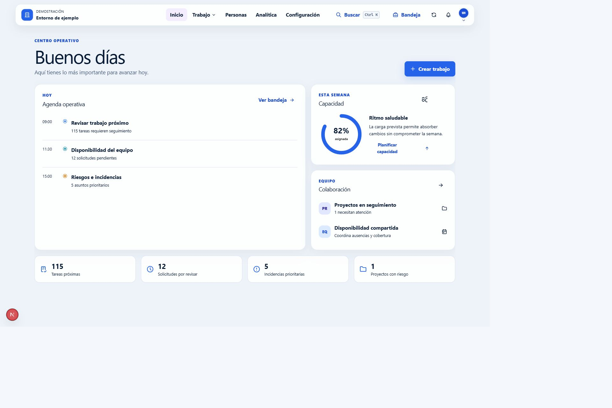
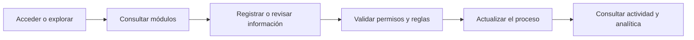
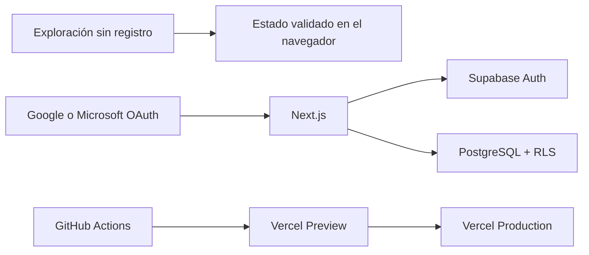

# Plataforma de gestión

**Versión 1.8.3** · [plataformagestion.app](https://plataformagestion.app)

[](https://github.com/antoniojesusdelgado/management-platform/releases/latest)
[](https://github.com/antoniojesusdelgado/management-platform/actions/workflows/ci.yml)


Plataforma de gestión centralizada para coordinar personas, proyectos, tareas,
vacaciones, incidencias, tesorería, nóminas y analítica en un mismo entorno.

[Probar la plataforma](https://plataformagestion.app) ·
[Ver el caso profesional](https://antoniodelgado.tech/proyectos/plataforma-de-gestion) ·
[Ver la última versión](https://github.com/antoniojesusdelgado/management-platform/releases/latest) ·
[Consultar seguridad](SECURITY.md) · [Configurar el proyecto](docs/DEPLOYMENT.md)



## Proyecto

### Necesidad

El proyecto original nació de una necesidad operativa de Fundación
Cibervoluntarios: centralizar procesos e información que estaban repartidos
entre hojas de cálculo y herramientas externas.

### Intervención

Como Analista Funcional, analicé los procesos, recogí requisitos y coordiné el
diseño, el desarrollo, las pruebas, la implantación y el despliegue de la
solución utilizada por la Fundación.

### Solución

El resultado es una plataforma modular que concentra la operativa diaria y
facilita la coordinación entre equipos, procesos e información. Este
repositorio recoge una evolución pública posterior y técnicamente aislada.

### Evidencia

La aplicación pública puede explorarse sin registro o utilizarse mediante
Google o Microsoft OAuth. Las cuentas autenticadas pueden crear empresas,
aceptar invitaciones y cambiar entre organizaciones aisladas. El modo de
exploración utiliza exclusivamente datos ficticios.

## Funciones principales

- Panel de inicio con prioridades, agenda y actividad reciente.
- Solicitudes y aprobaciones de vacaciones con calendario de ausencias.
- Proyectos y tareas en vistas Kanban, lista y bandeja personal.
- Incidencias con prioridad, compromisos de atención y seguimiento.
- Tesorería, conciliación y ciclos de nómina con información agregada.
- Directorio paginado, filtros combinables y organigrama por equipos.
- Analítica con filtros cruzados, detalle contextual y vistas guardadas.
- Búsqueda global con `Ctrl/Cmd+K` y bandeja personal de trabajo.
- Automatizaciones controladas, plantillas y recurrencias.
- Planificación de capacidad, informes CSV/XLSX e integraciones opcionales con
  Google Workspace o Microsoft 365.

## Cómo funciona



El modo de exploración mantiene un estado validado en el navegador. En el
entorno autenticado, cada acción vuelve a comprobar identidad, organización,
permisos y reglas de negocio antes de acceder a los datos.

## Arquitectura resumida



La aplicación usa Next.js, React, TypeScript, Supabase y PostgreSQL. Las pruebas
de navegador se ejecutan con Playwright y Axe. El acceso autenticado se protege
con políticas RLS, validación en servidor y permisos por organización.

Los tokens de las integraciones de productividad se procesan solo en servidor
y se almacenan cifrados mediante Supabase Vault. El modo invitado utiliza
adaptadores simulados y no abre conexiones externas. Consulta
[Integraciones de productividad](docs/WORKSPACE-INTEGRATIONS.md) para el detalle.

## Desarrollo asistido con inteligencia artificial

La plataforma se ha desarrollado mediante programación asistida con ChatGPT
Codex, bajo dirección, revisión y validación humana. Esta asistencia forma parte
del proceso de desarrollo, no de las funciones del producto.

La aplicación no llama a modelos de inteligencia artificial, no necesita una
clave de OpenAI y los datos del modo de exploración se generan de forma
determinista. El alcance se documenta en
[Transparencia y privacidad](docs/AI-TRANSPARENCY-AND-PRIVACY.md).

## Privacidad y alcance público

Este repositorio no contiene el sistema interno de la Fundación ni su código,
datos, documentos, credenciales, reglas internas o conexiones. La mención de la
organización explica el origen funcional del proyecto y no implica propiedad,
patrocinio, afiliación o respaldo sobre esta implementación pública.

Los registros del modo de exploración son ficticios y se generan de forma
determinista. No proceden de la Fundación ni de otra empresa real. La metodología
y sus límites están descritos en [Procedencia de los datos](docs/DATA-PROVENANCE.md).

Google Analytics 4 es opcional y solo se carga tras la aceptación del visitante.
Las cuentas autenticadas pueden solicitar su supresión desde «Mi perfil».

Contacto profesional y de privacidad:
[contacto@antoniodelgado.tech](mailto:contacto@antoniodelgado.tech).

## Desarrollo local

Requisitos: Bun 1.3.14 y, para la base de datos local, Docker Desktop.

```powershell
git clone https://github.com/antoniojesusdelgado/management-platform.git
Set-Location management-platform
bun install --frozen-lockfile
Copy-Item .env.example .env.local
bun run dev
```

Rutas principales:

- `http://localhost:3000/` — acceso público.
- `http://localhost:3000/login` — acceso a la aplicación.
- `http://localhost:3000/explorar` — exploración con datos ficticios.
- `http://localhost:3000/demo/embed` — redirección heredada a `/explorar`.
- `http://localhost:3000/app/inicio` — entorno autenticado.

Google OAuth requiere un proyecto Supabase propio. La configuración completa se
explica en la [guía de despliegue](docs/DEPLOYMENT.md).

## Validación

```powershell
bun run lint
bun run typecheck
bun run test
bun run content:validate
bun run security:public-data
bun run security:secrets
bun run scenario:data:validate
bun audit --audit-level=high
bun run build
bun run e2e
bun run e2e:a11y
git diff --check
```

La validación de base de datos necesita Docker:

```powershell
bunx supabase start
bunx supabase db reset
bunx supabase test db
bunx supabase db lint --local --level warning --fail-on error
bunx supabase gen types --lang typescript --local
```

## Variables de entorno

| Variable                               | Exposición | Uso                              |
| -------------------------------------- | ---------- | -------------------------------- |
| `NEXT_PUBLIC_APP_URL`                  | Navegador  | Origen canónico                  |
| `NEXT_PUBLIC_VERCEL_URL`               | Navegador  | Origen de Preview                |
| `NEXT_PUBLIC_SUPABASE_URL`             | Navegador  | Proyecto Supabase                |
| `NEXT_PUBLIC_SUPABASE_PUBLISHABLE_KEY` | Navegador  | Clave publicable                 |
| `PORTFOLIO_ORIGIN`                     | Servidor   | Origen autorizado para el iframe |
| `NEXT_PUBLIC_PRIVACY_CONTACT_EMAIL`    | Navegador  | Contacto legal público           |
| `NEXT_PUBLIC_GA_MEASUREMENT_ID`         | Navegador  | Identificador público de GA4     |

Los secretos de Google y Supabase no deben almacenarse en el repositorio ni
exponerse con el prefijo `NEXT_PUBLIC_`.

## Documentación

- [Caso de estudio técnico](docs/TECHNICAL-CASE-STUDY.md)
- [Arquitectura](docs/ARCHITECTURE.md)
- [Mapa de procesos](docs/PROCESS-MAPS.md)
- [Permisos y RLS](docs/PERMISSIONS.md)
- [Procedencia de los datos](docs/DATA-PROVENANCE.md)
- [Despliegue](docs/DEPLOYMENT.md)
- [Seguridad](SECURITY.md)
- [Licencias de terceros](docs/THIRD-PARTY-LICENSES.md)
- [Transparencia y privacidad](docs/AI-TRANSPARENCY-AND-PRIVACY.md)

## Derechos

Copyright © 2026 Antonio Jesús Delgado Briones. Todos los derechos reservados.

El código, la documentación y la identidad visual son de uso propietario.
Consulta [LICENSE](LICENSE) antes de copiar, modificar o redistribuir cualquier
parte del proyecto. Las dependencias conservan sus licencias originales.
