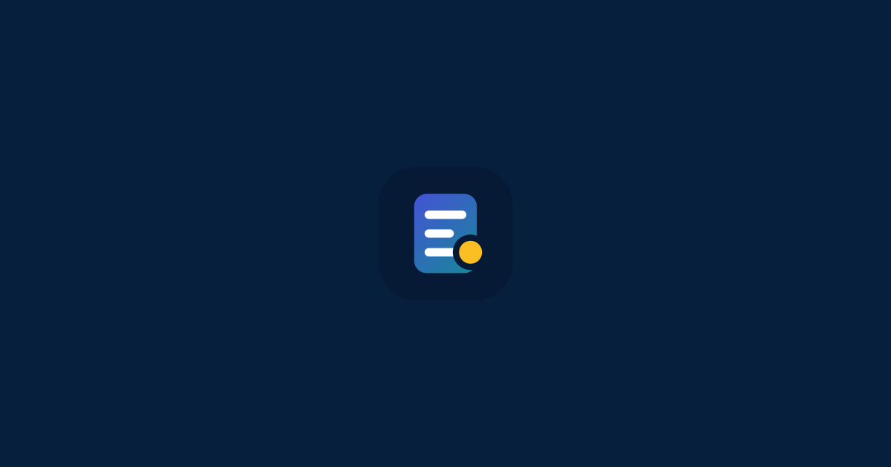
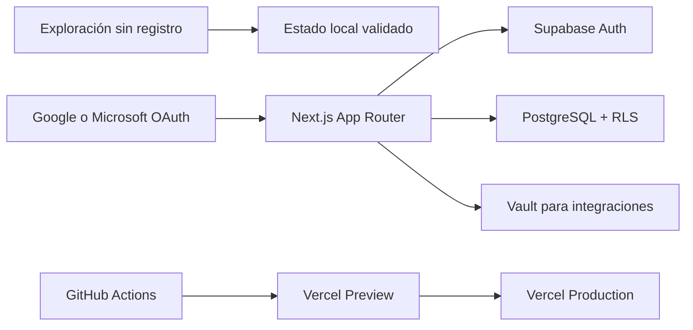

# Plataforma de gestión

[](https://github.com/antoniojesusdelgado/management-platform/actions/workflows/ci.yml)
[](https://github.com/antoniojesusdelgado/management-platform/releases/latest)

**Todo el trabajo, en un solo lugar.**

Plataforma modular para coordinar personas, proyectos, operaciones y analítica
desde un espacio común. El producto combina una experiencia pública de
exploración con un entorno autenticado, multiempresa y protegido por permisos.

[Explorar la plataforma](https://plataformagestion.app) ·
[Ver el caso de estudio](https://antoniodelgado.tech/proyectos/plataforma-de-gestion) ·
[Consultar la documentación](docs/README.md)



## El problema que aborda

Cuando la información vive en hojas de cálculo, conversaciones y herramientas
separadas, aumenta el esfuerzo necesario para coordinar el trabajo y obtener
una visión fiable. Plataforma de gestión reúne los principales recorridos de
una empresa y mantiene el contexto entre personas, tareas y decisiones.

## Capacidades principales

| Área | Capacidades |
| --- | --- |
| Trabajo | Proyectos, tareas en Kanban y lista, incidencias y bandeja personal |
| Personas | Directorio, organigrama, vacaciones, disponibilidad y capacidad |
| Operaciones | Automatizaciones controladas, plantillas, recurrencias y notificaciones |
| Gestión | Tesorería agregada, ciclos de nómina e información multiempresa |
| Analítica | Indicadores, filtros cruzados, comparaciones, vistas guardadas y exportaciones |
| Ecosistema | Acceso con Google o Microsoft e integraciones opcionales de productividad |

La búsqueda global permite localizar personas, proyectos, tareas e incidencias
con `Ctrl/Cmd+K`. La interfaz está preparada para escritorio y móvil, admite
teclado y movimiento reducido, y ofrece tema claro u oscuro por elección
explícita.

## Qué demuestra este repositorio

- Diseño de producto modular con recorridos conectados y lenguaje orientado a
  personas usuarias.
- Arquitectura Next.js y Supabase con separación entre presentación, dominio,
  acceso a datos y persistencia.
- Aislamiento por organización mediante Row Level Security, permisos estables
  y validación en servidor.
- Datos sintéticos deterministas para evaluar el producto sin publicar
  información empresarial o personal real.
- Entrega trazable mediante migraciones, CI, Preview, pruebas de navegador,
  accesibilidad y controles de seguridad.

## Arquitectura resumida



La exploración sin registro funciona en el navegador y no escribe en
Supabase. El área autenticada vuelve a comprobar sesión, organización y permiso
en el servidor; PostgreSQL repite el límite mediante RLS. Las autorizaciones de
Google Workspace y Microsoft 365 son opcionales e independientes del inicio de
sesión.

Consulta [Arquitectura](docs/ARCHITECTURE.md), [Permisos](docs/PERMISSIONS.md)
y [Seguridad](SECURITY.md) para el detalle técnico.

## Origen y límites del proyecto público

El proyecto nació del análisis de una necesidad operativa de Fundación
Cibervoluntarios: centralizar procesos repartidos entre hojas de cálculo y
herramientas externas. Antonio Delgado realizó el análisis de procesos, la
toma de requisitos, el desarrollo, las pruebas, la implantación y el
despliegue de la solución utilizada por la organización.

Este repositorio es una implementación pública posterior y técnicamente
aislada. No contiene el código, los datos, los documentos, las credenciales,
las reglas internas ni las conexiones de la Fundación. La referencia explica
el origen funcional y no implica patrocinio ni respaldo de este repositorio.

## Datos, privacidad y transparencia

El modo de exploración utiliza exclusivamente datos ficticios generados de
forma determinista. No contiene contactos reales, cuentas bancarias,
documentos, salarios individuales ni credenciales de terceros. La metodología
se documenta en [Procedencia de los datos](docs/DATA-PROVENANCE.md).

Google Analytics 4 solo se carga después de una elección afirmativa. Las
cuentas autenticadas disponen de un flujo irreversible de supresión y pueden
revocar sus conexiones de productividad. Contacto profesional y de privacidad:
[contacto@antoniodelgado.tech](mailto:contacto@antoniodelgado.tech).

El desarrollo se ha realizado con asistencia de ChatGPT Codex, bajo dirección,
revisión y validación humana. La aplicación desplegada no llama a modelos de
OpenAI ni envía datos a OpenAI. El alcance completo está en
[Transparencia, privacidad y analítica](docs/AI-TRANSPARENCY-AND-PRIVACY.md).

## Desarrollo local

Requisitos: Bun 1.3.14 y, para ejecutar Supabase local, Docker Desktop.

```powershell
git clone https://github.com/antoniojesusdelgado/management-platform.git
Set-Location management-platform
bun install --frozen-lockfile
Copy-Item .env.example .env.local
bun run dev
```

Rutas útiles:

- `http://localhost:3000/login`: acceso con Google, Microsoft o exploración.
- `http://localhost:3000/explorar`: recorrido sin registro con datos ficticios.
- `http://localhost:3000/app/inicio`: área autenticada.
- `/demo/embed`: redirección heredada a `/explorar`.

La configuración completa de Supabase, OAuth y Vercel se encuentra en
[Despliegue](docs/DEPLOYMENT.md).

## Verificación

```powershell
bun run lint
bun run typecheck
bun run test
bun run content:validate
bun run security:public-data
bun run security:secrets
bun run scenario:data:validate
bun audit --audit-level=high
bun run build
bun run e2e
bun run e2e:a11y
git diff --check
```

Las comprobaciones de base de datos requieren Docker:

```powershell
bunx supabase start
bunx supabase db reset
bunx supabase test db
bunx supabase db lint --local --level warning --fail-on error
bunx supabase gen types --lang typescript --local
```

## Documentación

El [índice de documentación](docs/README.md) organiza las guías por audiencia:
producto, arquitectura, seguridad, operación y decisiones técnicas. El historial
de cambios pertenece a [GitHub Releases](https://github.com/antoniojesusdelgado/management-platform/releases)
y no se duplica en los manuales activos.

## Uso y colaboración

El código, la documentación y la identidad visual son propietarios. Consulta
[LICENSE](LICENSE) antes de copiar, modificar o redistribuir el proyecto.
[CONTRIBUTING.md](CONTRIBUTING.md) explica cómo comunicar propuestas y
[SUPPORT.md](SUPPORT.md) reúne los canales de ayuda y seguridad.
