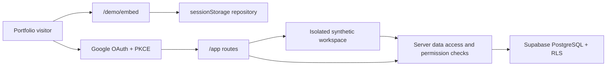
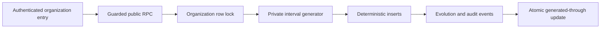

# Architecture

## System boundaries

The guest and authenticated paths share domain types and visual components but
use separate repositories. Guest code cannot obtain database credentials or
write to Supabase.

Google OAuth is a public demonstration entry point, not a shared tenancy
boundary. A privileged, idempotent database function creates one isolated
organization per Google identity and assigns a system role containing every
stable demo permission. The application profile uses a synthetic alias and
does not copy the provider name, email or avatar.

## Runtime layers

1. **UI:** Next.js App Router, React, Tailwind CSS and Radix primitives.
2. **Domain:** typed modules, stable permission codes and explicit Leave,
   Task, Incident, Changelog, Treasury and Payroll transitions.
3. **Application:** client demo reducer and server-side authenticated actions.
4. **Data access:** Supabase clients scoped to browser, server and proxy needs.
5. **Database:** multi-organization PostgreSQL schema with RLS and immutable
   transition events.

## Multi-organization model

Every operational record carries `organization_id`. Memberships connect a
profile, organization and role. Role names and colors are editable metadata;
permission codes remain stable application contracts.

Role metadata and permission assignments use separate mutations. Administrative
changes to organization identity, modules, roles, invitations and memberships
produce immutable audit events.

Treasury stores only aggregated synthetic concepts, dates, integer minor-unit
amounts and ISO currency codes. Its monotonic status workflow is executed by
privileged RPCs that repeat authentication, organization and permission checks;
authenticated roles receive no direct insert or update privileges on Treasury
tables. Creation, draft edits and transitions append immutable events.

Payroll stores only periods, synthetic people counts and aggregate gross,
deduction and database-derived net totals. It excludes individual compensation,
tax identifiers, receipts and documents. Collection edits and monotonic status
changes run through privileged RPCs and append immutable events; authenticated
roles receive no direct table writes.

The guest state is currently version 17 and Scenario V7. Zod validates restored
sessions before rendering. The V14 to V15 migration preserves operational
changes and preferences while appending only missing deterministic entities;
the V15 to V16 migration adds the v1.3.0 editorial release entry without
regenerating the daily scenario. V16 to V17 appends v1.3.1 once and preserves
the existing session graph.

Theme selection is explicit: new and legacy workspaces resolve to `light` by
default, while `dark` is enabled manually from the profile. The runtime does
not follow operating-system color-scheme changes; legacy `system` values are
normalized to `light` in session state and in the compatible SQL migration.

People creation and editing reuse the distinct team values already persisted
for the active organization. The UI exposes those values as a closed selector,
and the authenticated Server Action repeats the organization-scoped existence
check before persisting the profile. Professional start and end dates are
written together with the remaining employment fields.

Authenticated workspaces call `ensure_demo_scenario_current` before module
queries. PostgreSQL locks the organization row, generates only the missing
interval through yesterday in `Europe/Madrid`, inserts deterministic IDs with
`ON CONFLICT DO NOTHING`, appends an evolution/audit event and advances the
horizon atomically.

For legacy organizations, `scenario_v7_backfilled_at` is independent from the
daily generated-through date. The RPC checks that marker before its early
return, fills only missing deterministic rows, preserves existing records and
records one `backfilled` evolution event in the same transaction.

Dynamic `/app`, `/auth` and `/login` surfaces receive a per-request script
nonce in `proxy.ts`; public static routes retain the cache-compatible baseline
CSP. PostgREST uses a database pre-request guard for mutation bursts, while
Vercel Firewall remains the outer IP-based observation layer.

Analytics exposes `AnalyticsServiceDimension { code, label, kind }`. Connector
UUIDs and historical incident labels remain internal bindings. Saved filters,
KPIs, comparisons, alerts, drill-down and accessible tables all use the same
stable service code.

The server checks authorization close to the write and RLS repeats the boundary
inside PostgreSQL. The organization identifier sent by the client is never
trusted on its own.

## Scenario V7 data path

