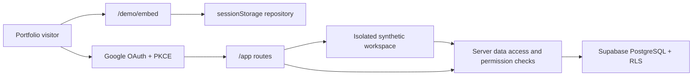

# Architecture

## System boundaries

The guest and authenticated paths share domain types and visual components but
use separate repositories. Guest code cannot obtain database credentials or
write to Supabase.

Google OAuth is a public demonstration entry point, not a shared tenancy
boundary. A privileged, idempotent database function creates one isolated
organization per Google identity and assigns a system role containing every
stable demo permission. The application profile uses a synthetic alias and
does not copy the provider name, email or avatar.

## Runtime layers

1. **UI:** Next.js App Router, React, Tailwind CSS and Radix primitives.
2. **Domain:** typed modules, stable permission codes and explicit Leave,
   Task, Incident, Changelog, Treasury and Payroll transitions.
3. **Application:** client demo reducer and server-side authenticated actions.
4. **Data access:** Supabase clients scoped to browser, server and proxy needs.
5. **Database:** multi-organization PostgreSQL schema with RLS and immutable
   transition events.

## Multi-organization model

Every operational record carries `organization_id`. Memberships connect a
profile, organization and role. Role names and colors are editable metadata;
permission codes remain stable application contracts.

Role metadata and permission assignments use separate mutations. Administrative
changes to organization identity, modules, roles, invitations and memberships
produce immutable audit events.

Treasury stores only aggregated synthetic concepts, dates, integer minor-unit
amounts and ISO currency codes. Its monotonic status workflow is executed by
privileged RPCs that repeat authentication, organization and permission checks;
authenticated roles receive no direct insert or update privileges on Treasury
tables. Creation, draft edits and transitions append immutable events.

Payroll stores only periods, synthetic people counts and aggregate gross,
deduction and database-derived net totals. It excludes individual compensation,
tax identifiers, receipts and documents. Collection edits and monotonic status
changes run through privileged RPCs and append immutable events; authenticated
roles receive no direct table writes.

The guest state is currently version 6. Zod validates restored sessions and
incremental migrations preserve versions 1 through 5 before rendering.

The server checks authorization close to the write and RLS repeats the boundary
inside PostgreSQL. The organization identifier sent by the client is never
trusted on its own.
