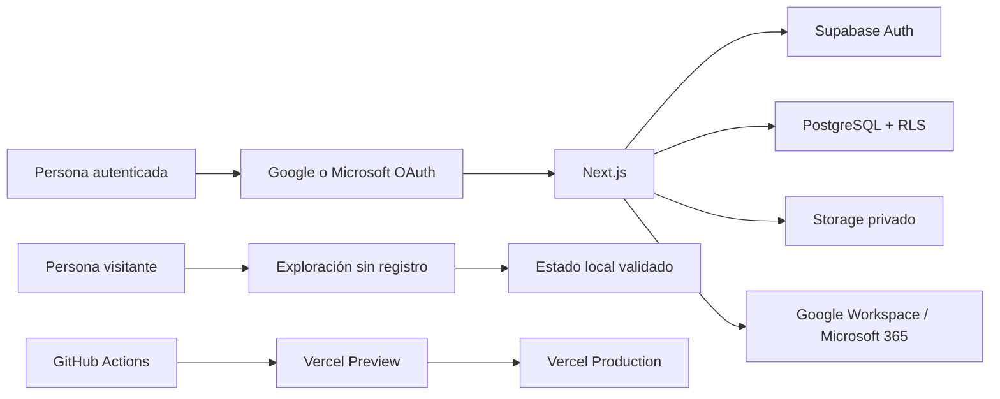
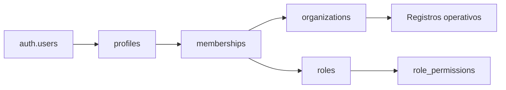
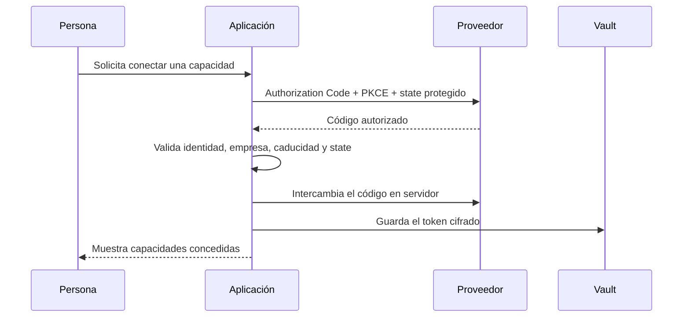

# Arquitectura

## Objetivo

Plataforma de gestión separa con claridad la experiencia pública, el área
autenticada y los proveedores externos. La arquitectura busca mantener tres
propiedades: aislamiento entre organizaciones, datos públicos seguros y
recorridos de producto verificables.

## Contexto del sistema

La exploración y el área autenticada comparten contratos de dominio y
componentes visuales, pero no el repositorio de datos. La primera conserva un
estado sintético en el navegador; la segunda utiliza Supabase y vuelve a
comprobar autorización en cada lectura o mutación.

## Capas

| Capa | Responsabilidad |
| --- | --- |
| Presentación | App Router, React, componentes accesibles, estados de carga y navegación persistente |
| Aplicación | Server Components, Server Actions, loaders por módulo y orquestación de casos de uso |
| Dominio | Contratos TypeScript, transiciones cerradas, validación Zod y cálculos puros |
| Acceso a datos | Consultas acotadas, proyecciones por módulo y resolución de permisos |
| Persistencia | PostgreSQL, RLS, RPC autorizadas, auditoría, Storage y Vault |
| Entrega | Migraciones, GitHub Actions, Vercel Preview y promoción controlada |

Los módulos cargan solo la información que necesitan. La empresa activa, el
perfil y los permisos se resuelven una vez por petición y se reutilizan durante
el recorrido del módulo.

## Dos recorridos de datos

### Exploración sin registro

`/explorar` carga `GuestWorkspaceState`, validado con Zod y almacenado en
`sessionStorage`. Los cambios pertenecen a esa pestaña y no llegan a Supabase
ni a servicios externos. La clave actual migra automáticamente el estado
compatible de versiones anteriores.

`/demo/embed` se conserva como redirección permanente por compatibilidad con
enlaces históricos.

### Área autenticada

Google o Microsoft autentican mediante Supabase OAuth con PKCE. Tras el
callback, la aplicación recupera una empresa activa, una invitación pendiente o
el onboarding. La cookie de empresa activa mejora la navegación, pero no
autoriza: la membresía y RLS se comprueban de nuevo en servidor y base de datos.

## Modelo multiorganización

Cada registro operativo incluye `organization_id`. Las membresías relacionan
perfil, organización y rol; los roles agrupan códigos de permiso estables. Los
nombres y colores pueden cambiar, pero un código no puede reutilizarse con otra
finalidad.

Las Server Actions verifican sesión, empresa y permiso cerca de cada escritura.
RLS repite el límite en PostgreSQL. Las funciones con privilegios elevados son
excepciones explícitas: viven en esquemas internos cuando corresponde, usan
`search_path` vacío y revocan `EXECUTE` a `PUBLIC`.

## Módulos

- **Trabajo:** proyectos, tareas, incidencias y bandeja personal.
- **Personas:** directorio, organigrama, vacaciones y disponibilidad.
- **Operaciones:** automatizaciones cerradas, plantillas, recurrencias,
  capacidad, notificaciones y exportaciones.
- **Gestión:** tesorería y nóminas con información ficticia agregada.
- **Analítica:** indicadores, filtros cruzados, comparaciones, detalle y vistas
  guardadas sobre dimensiones estables.

Los eventos de transición mantienen trazabilidad sin crear una segunda fuente
de verdad. Las colecciones crecientes se paginan y los comentarios o
dependencias se limitan a la página visible.

## Integraciones

La identidad de acceso y la autorización de productividad son procesos
independientes. Una persona puede iniciar sesión con Google y conectar
Microsoft 365, o al revés.

Los contratos comunes cubren archivos, hojas de cálculo, correo y calendario.
Las acciones externas requieren confirmación y los trabajos grandes se
ejecutan por lotes. La sincronización de directorio solo se habilita para una
cuenta corporativa con consentimiento administrativo.

## Datos sintéticos y evolución

Scenario V7 genera un conjunto reproducible para la exploración y para espacios
autenticados de evaluación. Los identificadores son deterministas y las
actualizaciones son aditivas e idempotentes: no eliminan ni sobrescriben
registros operativos modificados.

Las organizaciones antiguas distinguen la actualización diaria del backfill
histórico. PostgreSQL bloquea la organización, inserta únicamente entidades
ausentes, registra auditoría y avanza el horizonte de forma atómica.

Los nombres históricos `GuestDemoState`, `demo:data:*` y
`ensure_demo_scenario_current` permanecen como contratos de compatibilidad.
Las superficies activas utilizan `GuestWorkspaceState`, `scenario:data:*` y
la denominación «modo de exploración».

## Seguridad, privacidad y observabilidad

- CSP con nonce en superficies dinámicas y framing restringido.
- Validación Unicode, límites de longitud y rechazo de marcado ejecutable.
- Consultas parametrizadas y RLS en todas las tablas de aplicación.
- Tokens en servidor y referencias cifradas mediante Vault.
- Consentimiento analítico denegado por defecto.
- Procesamiento de avatares en servidor y almacenamiento privado.
- CodeQL, revisión de dependencias, escaneo de secretos, pgTAP y ZAP.

ChatGPT Codex forma parte del proceso supervisado de ingeniería, no de la
arquitectura desplegada. La aplicación no necesita una clave de OpenAI ni envía
datos a OpenAI.

## Decisiones relacionadas

- [ADR 0001: tecnologías y límites](adr/0001-stack-and-boundaries.md)
- [ADR 0002: autenticación y RLS](adr/0002-authentication-and-rls.md)
- [ADR 0003: exploración integrada](adr/0003-embedded-demo.md)
- [Modelo de permisos](PERMISSIONS.md)
- [Integraciones de productividad](WORKSPACE-INTEGRATIONS.md)
- [Procedencia de los datos](DATA-PROVENANCE.md)
