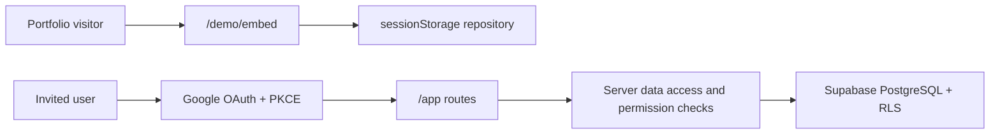

# Architecture

## System boundaries

The guest and authenticated paths share domain types and visual components but
use separate repositories. Guest code cannot obtain database credentials or
write to Supabase.

## Runtime layers

1. **UI:** Next.js App Router, React, Tailwind CSS and Radix primitives.
2. **Domain:** typed modules, stable permission codes and Leave state
   transitions.
3. **Application:** client demo reducer and server-side authenticated actions.
4. **Data access:** Supabase clients scoped to browser, server and proxy needs.
5. **Database:** multi-organization PostgreSQL schema with RLS and immutable
   transition events.

## Multi-organization model

Every operational record carries `organization_id`. Memberships connect a
profile, organization and role. Role names and colors are editable metadata;
permission codes remain stable application contracts.

The server checks authorization close to the write and RLS repeats the boundary
inside PostgreSQL. The organization identifier sent by the client is never
trusted on its own.
