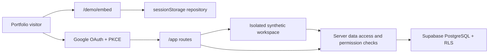
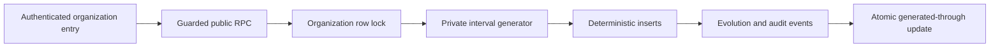

# Arquitectura

## Correcciones v1.8.2

v1.8.2 separa tres finalidades OAuth: identidad básica, productividad y
directorio corporativo. El inicio de sesión no solicita acceso a archivos,
calendarios ni personas. Los permisos adicionales se conceden desde
Integraciones y el procesamiento de directorio solo puede ejecutarlo el
servidor con credenciales protegidas.

El cliente Supabase de servidor se reutiliza durante cada petición y los
contratos temporales normalizan las fechas válidas a ISO antes de validarlas.
Los avatares se decodifican, redimensionan y recodifican en WebP desde una
Server Action autenticada antes de llegar al bucket privado.

La capa raíz incluye un gestor de consentimiento local. Google Analytics 4 no
se descarga hasta recibir una elección afirmativa; el cambio de preferencia
está disponible desde cualquier pie legal. La configuración de Content Security
Policy permite únicamente los hosts necesarios de Google Analytics y mantiene
el resto de scripts bajo nonce en las superficies dinámicas.

La supresión de cuenta se orquesta desde una Server Action autenticada. Una RPC
anonimiza el perfil, desvincula las personas, suspende membresías y elimina los
secretos de integración. A continuación, el cliente administrativo de Supabase
realiza un borrado irreversible de la identidad Auth. La clave secreta permanece
en servidor y la base conserva únicamente una prueba criptográfica no
identificativa de la solicitud.

## Correcciones v1.8.1

v1.8.1 conserva la arquitectura multiempresa de v1.8.0 y corrige su capa de
presentación y lectura. El acceso utiliza una composición compacta basada en
`100dvh`; los módulos comparten una retícula de hasta 1.600 px, márgenes
adaptativos y estados vacíos consistentes. La navegación precarga los destinos
principales y cada módulo dispone de un estado `loading.tsx` inmediato.

La creación adicional de empresas vive en `/app/empresas/nueva`. Reutiliza el
onboarding en modo creación, activa la organización nueva y mantiene las
membresías anteriores. El saludo se calcula en servidor con la zona horaria del
perfil para evitar cambios durante la hidratación.

Las conexiones externas distinguen tres conceptos: proveedor de acceso,
productividad y directorio corporativo. `workspace_connections` conserva los
ámbitos concedidos, el tipo de cuenta y la autorización administrativa; el
estado operativo del directorio sigue perteneciendo a
`organization_directory_settings`.

Personal limita el directorio visible a 24 perfiles por página y deriva el
organigrama desde las relaciones existentes, sin duplicar una segunda fuente
de verdad. Analítica mantiene el mismo `AnalyticsSnapshot` para indicadores,
lecturas guiadas, filtros cruzados y detalle contextual. Novedades ordena por
fecha y versión para que la publicación más reciente sea siempre la primera.

## Evolución v1.8.0

La aplicación autenticada ya no crea automáticamente una demostración por
identidad. Después de Google o Microsoft OAuth, la persona recupera su última
empresa activa, acepta una invitación o completa el onboarding. La empresa
activa se persiste en el perfil y en una cookie `httpOnly`; cada consulta sigue
validando membresía, permiso y organización mediante RLS.

Google Workspace y Microsoft 365 se autorizan después del login. Los tokens se
mantienen en Vault y el directorio sincroniza únicamente identidad corporativa,
equipo y estado. Roles, permisos, asignaciones e histórico pertenecen a la
plataforma y nunca se sobrescriben desde el proveedor.

## Límites del sistema

Las rutas sin registro y autenticada comparten tipos de dominio y componentes
visuales, pero utilizan repositorios de datos separados. El código de la demo
sin registro no puede obtener credenciales de base de datos ni escribir en
Supabase.

Google OAuth es una entrada pública a la demostración, no un límite de tenencia
compartida. Una función de base de datos idempotente y con privilegios crea una
organización aislada por identidad de Google y asigna un rol del sistema con
todos los permisos estables de la demo. El perfil de aplicación utiliza un alias
ficticio y no copia el nombre, el correo ni el avatar del proveedor.

ChatGPT Codex interviene únicamente en el proceso supervisado de desarrollo. No
es un contenedor, servicio ni dependencia del sistema desplegado, no recibe
datos de ejecución y no necesita credenciales en Vercel o Supabase.

## Capas de ejecución

1. **Interfaz:** Next.js App Router, React, Tailwind CSS y primitivas de Radix.
2. **Dominio:** módulos tipados, códigos estables de permiso y transiciones
   explícitas para Vacaciones, Tareas, Incidencias, Novedades, Tesorería y
   Nóminas.
3. **Aplicación:** reducer de la demo en cliente y acciones autenticadas en
   servidor.
4. **Acceso a datos:** clientes de Supabase adaptados al navegador, servidor y
   proxy.
5. **Base de datos:** esquema PostgreSQL multiorganización con RLS y eventos de
   transición inmutables.

El centro de trabajo es una capacidad transversal del shell. En la demo sin
registro deriva búsqueda y bandeja del estado local ya validado; en el acceso
OAuth utiliza Server Actions autenticadas, consultas acotadas y RLS. Los
resultados solo contienen una proyección mínima y sus enlaces abren la entidad
concreta. La bandeja no crea otro estado: ordena tareas, solicitudes,
incidencias y avisos que siguen perteneciendo a sus módulos de origen.

El catálogo TypeScript de versiones alimenta el escenario invitado y la versión
visible. Una prueba lo compara con `package.json` y con la copia SQL que se
inserta de forma aditiva en las organizaciones autenticadas.

## Modelo multiorganización

Cada registro operativo incluye `organization_id`. Las pertenencias relacionan
un perfil, una organización y un rol. Los nombres y colores de los roles son
metadatos editables; los códigos de permiso permanecen como contratos estables
de la aplicación.

Los metadatos de rol y la asignación de permisos utilizan mutaciones separadas.
Los cambios administrativos de identidad, módulos, roles, invitaciones y
pertenencias producen eventos de auditoría inmutables.

Tesorería almacena únicamente conceptos agregados ficticios, fechas, importes
enteros en unidades menores y códigos de moneda ISO. Su flujo de estados
monótono se ejecuta mediante RPC con privilegios que repiten las comprobaciones
de autenticación, organización y permiso. Los roles autenticados no reciben
permisos directos de inserción o actualización en las tablas de Tesorería. La
creación, edición de borradores y transición de estados añade eventos
inmutables.

Nóminas almacena solo periodos, recuentos ficticios de personas y totales
agregados de bruto, deducciones y neto calculado por la base de datos. Excluye
retribuciones individuales, identificadores fiscales, recibos y documentos.
Las ediciones y transiciones se ejecutan mediante RPC con privilegios y añaden
eventos inmutables; los roles autenticados no escriben directamente en sus
tablas.

El estado invitado está en la versión 21 y utiliza Scenario V7. Zod valida las
sesiones restauradas antes de mostrarlas. La migración V14 a V15 conserva los
cambios operativos y preferencias y añade solo las entidades deterministas que
faltan. V15 a V16 incorpora la entrada editorial v1.3.0 sin regenerar el
escenario diario. V16 a V17 añade v1.3.1 una sola vez y conserva el grafo de la
sesión. V17 a V18 incorpora v1.3.2 y actualiza únicamente el texto canónico
publicado, sin modificar entradas editoriales personalizadas. V18 a V19 añade
las publicaciones hasta v1.5.1, V19 a V20 incorpora v1.6.0 y V20 a V21 añade
operaciones, capacidad, notificaciones y exportaciones sin reconstruir el resto
de la sesión.

## Operaciones e integraciones

`operaciones` agrupa reglas cerradas, plantillas, recurrencias, capacidad,
notificaciones y trabajos de exportación. Las Server Actions vuelven a validar
los datos y permisos; el cliente no puede enviar SQL, JavaScript, URLs ni nombres
de tablas. Las recurrencias se procesan en una función privada programada y
utilizan identificadores deterministas por serie y periodo.

Los proveedores externos implementan el mismo contrato de capacidades. OAuth
usa PKCE y estado firmado; los tokens quedan cifrados en Vault y solo el servidor
puede recuperarlos. La descarga local y los compositores de correo funcionan sin
conceder acceso a archivos o buzones externos.

La elección de tema es explícita: los espacios nuevos y antiguos utilizan
`light` de forma predeterminada y `dark` se activa manualmente desde el perfil.
La aplicación no sigue cambios de color del sistema operativo; los valores
históricos `system` se normalizan a `light` tanto en la sesión como en la
migración SQL compatible.

La creación y edición de personas reutiliza los equipos distintos ya
almacenados en la organización activa. La interfaz los presenta en un selector
cerrado y la Server Action autenticada vuelve a comprobar su existencia dentro
de la organización antes de guardar el perfil. Las fechas profesionales de
inicio y fin se almacenan junto al resto de datos laborales.

Las personas de Scenario V7 comparten un único contrato de nombres naturales
deterministas entre el generador invitado y PostgreSQL. Un trigger privado
sustituye únicamente los marcadores numerados conocidos. La migración v1.3.2
actualiza esos identificadores existentes sin insertar, eliminar ni cambiar
perfiles editados por el usuario.

Los espacios autenticados llaman a `ensure_demo_scenario_current` antes de
consultar los módulos. PostgreSQL bloquea la fila de la organización, genera
solo el intervalo que falte hasta ayer en `Europe/Madrid`, inserta
identificadores deterministas con `ON CONFLICT DO NOTHING`, añade los eventos de
evolución y auditoría y avanza el horizonte de forma atómica.

En organizaciones antiguas, `scenario_v7_backfilled_at` es independiente de la
fecha diaria generada. La RPC comprueba esa marca antes de finalizar, completa
solo las filas deterministas ausentes, conserva los registros existentes y
registra un único evento `backfilled` en la misma transacción.

Las superficies dinámicas `/app`, `/auth` y `/login` reciben un nonce de script
por solicitud en `proxy.ts`; las rutas públicas estáticas conservan una CSP
compatible con caché. PostgREST utiliza una comprobación previa en la base de
datos para ráfagas de mutaciones y Vercel Firewall actúa como capa exterior de
observación por IP.

Analítica expone `AnalyticsServiceDimension { code, label, kind }`. Los UUID de
conectores y las etiquetas históricas de incidencias quedan como relaciones
internas. Los filtros guardados, indicadores, comparaciones, alertas, detalle y
tablas accesibles utilizan el mismo código estable de servicio.

El servidor comprueba la autorización cerca de cada escritura y RLS repite el
límite dentro de PostgreSQL. El identificador de organización enviado por el
cliente nunca se considera suficiente por sí solo.

## Recorrido de datos de Scenario V7

