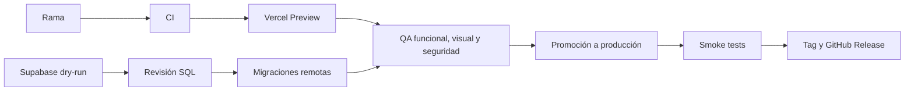

# Despliegue

## Modelo de publicación

Cada cambio se valida primero en una rama y en Vercel Preview. Producción se
obtiene promoviendo exactamente el artefacto revisado; no se reconstruye un
candidato diferente. Las migraciones de Supabase se aplican antes de promover
la aplicación cuando el código depende de ellas.



## 1. Preparación local

Requisitos:

- Bun 1.3.14.
- Docker Desktop para Supabase local.
- Supabase CLI y Vercel CLI autenticadas cuando se opere contra servicios
  remotos.
- Variables locales basadas en `.env.example`, nunca en secretos de
  producción copiados al repositorio.

```powershell
bun install --frozen-lockfile
bunx supabase start
bunx supabase db reset
bunx supabase test db
bunx supabase db lint --local --level warning --fail-on error
bunx supabase gen types --lang typescript --local
bun run lint
bun run typecheck
bun run test
bun run content:validate
bun run security:public-data
bun run security:secrets
bun run scenario:data:validate
bun audit --audit-level=high
bun run build
bun run e2e
bun run e2e:a11y
git diff --check
```

Los tipos generados deben coincidir con
`src/lib/supabase/database.types.ts`. Si una comprobación genera archivos,
revísalos y restaura los que no pertenezcan al cambio antes de publicar.

## 2. Supabase

### Revisión local

1. Ejecutar un reset completo desde cero.
2. Confirmar que pgTAP y Database Linter no introducen errores.
3. Ejecutar dos veces cualquier migración idempotente relevante.
4. Comparar los tipos generados con el archivo versionado.
5. Revisar las funciones `SECURITY DEFINER` y sus privilegios.

### Revisión remota

```powershell
bunx supabase link --project-ref <project-ref>
bunx supabase migration list --linked
bunx supabase db push --dry-run
```

El historial local y remoto debe entenderse antes de aplicar cambios. Si existen
migraciones solo locales o solo remotas, no se debe forzar el push: primero hay
que reconciliar el historial y comprobar su procedencia.

Aplicar únicamente después de obtener un dry-run legible, aditivo y compatible:

```powershell
bunx supabase db push
```

Después del push, repetir `migration list --linked`, revisar Security Advisor y
comprobar aislamiento con al menos dos organizaciones de prueba.

## 3. Proveedores de acceso

Supabase Auth utiliza el callback:

```text
https://<project-ref>.supabase.co/auth/v1/callback
```

Google y Microsoft para inicio de sesión solicitan identidad básica. Los
permisos de Drive, Sheets, OneDrive, Excel, Calendar o directorio se conceden
mediante aplicaciones y callbacks independientes, descritos en
[Integraciones de productividad](WORKSPACE-INTEGRATIONS.md).

`MICROSOFT_SIGN_IN_ENABLED=true` solo debe activarse cuando Azure esté
configurado correctamente en Supabase Auth. Una interfaz activa no sustituye la
validación real del proveedor.

## 4. Variables de entorno

| Variable | Entorno | Finalidad |
| --- | --- | --- |
| `NEXT_PUBLIC_APP_URL` | Público | Origen canónico |
| `NEXT_PUBLIC_VERCEL_URL` | Público | Origen de Preview |
| `NEXT_PUBLIC_SUPABASE_URL` | Público | URL del proyecto |
| `NEXT_PUBLIC_SUPABASE_PUBLISHABLE_KEY` | Público | Clave publicable |
| `PORTFOLIO_ORIGIN` | Servidor | Origen autorizado para framing |
| `NEXT_PUBLIC_PRIVACY_CONTACT_EMAIL` | Público | Contacto legal |
| `NEXT_PUBLIC_GA_MEASUREMENT_ID` | Público | Identificador de GA4 |
| `MICROSOFT_SIGN_IN_ENABLED` | Servidor | Disponibilidad del acceso Microsoft |
| `SUPABASE_SECRET_KEY` | Servidor | Operaciones administrativas autorizadas |
| `WORKSPACE_OAUTH_STATE_SECRET` | Servidor | Protección del estado OAuth |
| Secretos Google y Microsoft 365 | Servidor | Integraciones de productividad |

Los secretos deben configurarse por separado en Preview y Production. Nunca se
declaran con `NEXT_PUBLIC_`, se imprimen en logs ni se copian a documentación.

## 5. Preview

1. Crear o actualizar el pull request.
2. Esperar CI, CodeQL y Dependency Review.
3. Identificar la Preview asociada al SHA exacto.
4. Ejecutar Playwright contra ese host:

```powershell
$env:PLAYWRIGHT_BASE_URL = "https://<preview-host>"
bun run e2e
bun run e2e:a11y
Remove-Item Env:PLAYWRIGHT_BASE_URL
```

5. Validar acceso, exploración, onboarding, cambio de empresa y módulos
   principales en móvil y escritorio.
6. Comprobar tema claro y oscuro, teclado, foco, ausencia de overflow y estados
   de carga.
7. Revisar OAuth real solo con cuentas de prueba autorizadas.
8. Ejecutar ZAP Baseline contra el host validado y conservar el informe como
   artefacto.

## 6. Producción

Promover la Preview aprobada mediante Vercel. Después:

- comprobar `/login`, `/explorar` y `/app/inicio`;
- validar Google, Microsoft y cierre de sesión;
- confirmar consentimiento analítico y páginas legales;
- ejecutar una lectura y una mutación autorizada en dos organizaciones aisladas;
- revisar logs de errores, funciones y Firewall;
- confirmar que el árbol desplegado corresponde al SHA aprobado.

Si el merge genera otro despliegue, comparar ambos árboles. Si difieren o el
nuevo artefacto falla, restaurar como producción la Preview ya validada.

## 7. Release

La etiqueta se crea sobre el commit incluido en `main`. Las notas deben estar
en español y describir:

- cambios visibles;
- migraciones aplicadas;
- validaciones ejecutadas;
- riesgos o limitaciones conocidos;
- pasos de actualización cuando sean necesarios.

El historial detallado pertenece a
[GitHub Releases](https://github.com/antoniojesusdelgado/management-platform/releases),
no a este runbook.

## Recuperación

- **Aplicación:** promover el último despliegue estable en Vercel.
- **Variable:** restaurar el valor anterior desde el gestor de secretos.
- **Proveedor OAuth:** desactivar la capacidad afectada sin deshabilitar el
  resto de accesos.
- **Base de datos:** utilizar una migración correctiva hacia delante. No editar
  migraciones ya aplicadas ni ejecutar resets en remoto.
- **Integración externa:** revocar la conexión y solicitar consentimiento de
  nuevo; no reconstruir tokens manualmente.

La configuración de límites y falsos positivos se mantiene en
[Vercel Firewall](VERCEL-FIREWALL.md).
