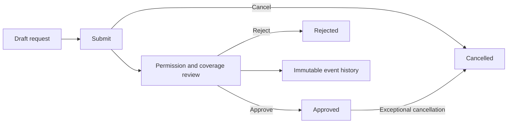
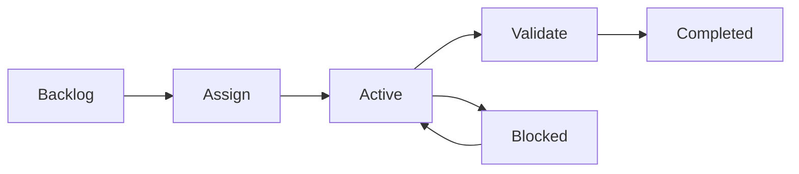
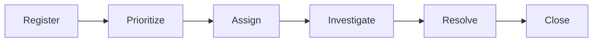
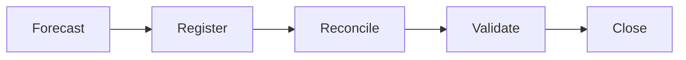
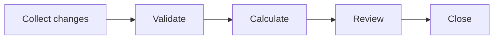
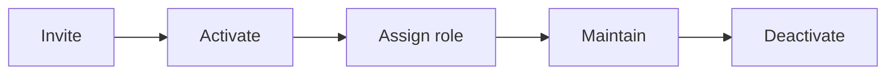
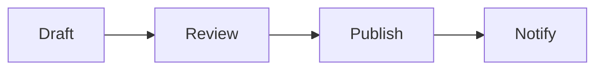
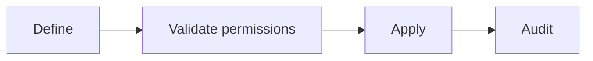

# Process maps

All maps describe the neutral demonstration, not internal employer workflows.

## Leave

## Tasks

## Incidents

## Treasury

## Payroll

## People

## Changelog

## Settings

