# Mapas de procesos

## Exportación conectada

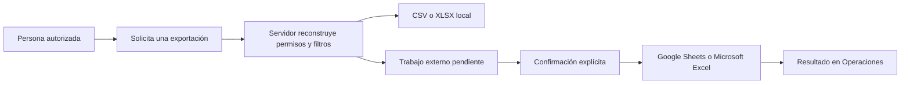

## Conexión de productividad

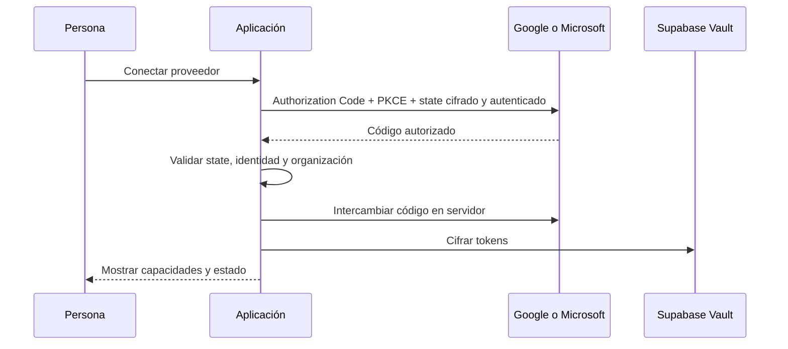

Todos los diagramas describen el entorno público con datos ficticios, no
procesos internos de una organización real.

## Consentimiento analítico

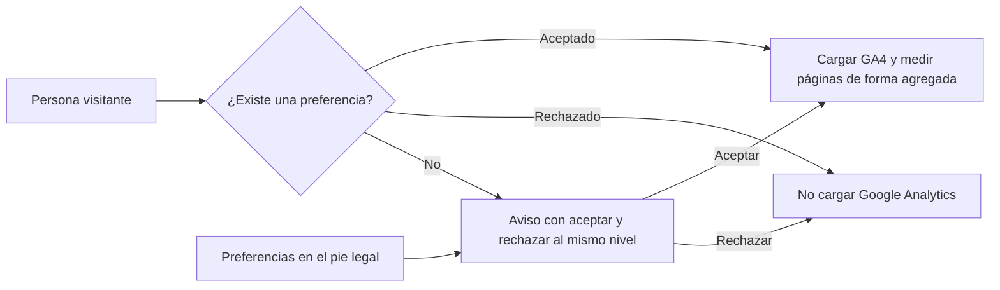

## Supresión de cuenta

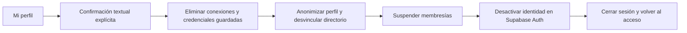

## Vacaciones

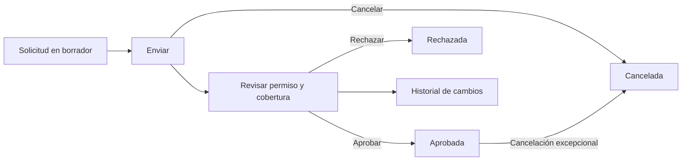

## Tareas

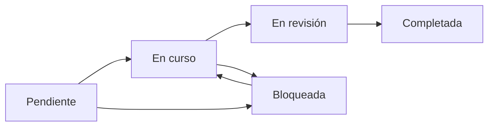

## Incidencias

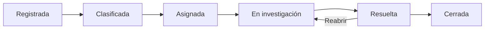

## Tesorería

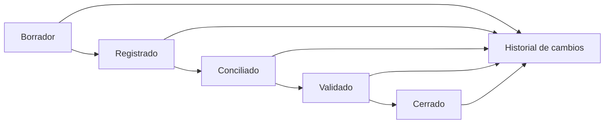

## Nóminas

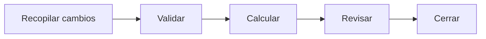

Solo pueden editarse los ciclos que están en fase de recopilación. Cada
transición exige una nota de decisión y añade un evento inmutable. Los valores
son agregados ficticios; los registros individuales de nómina quedan fuera de
los límites del entorno público.

## Personal

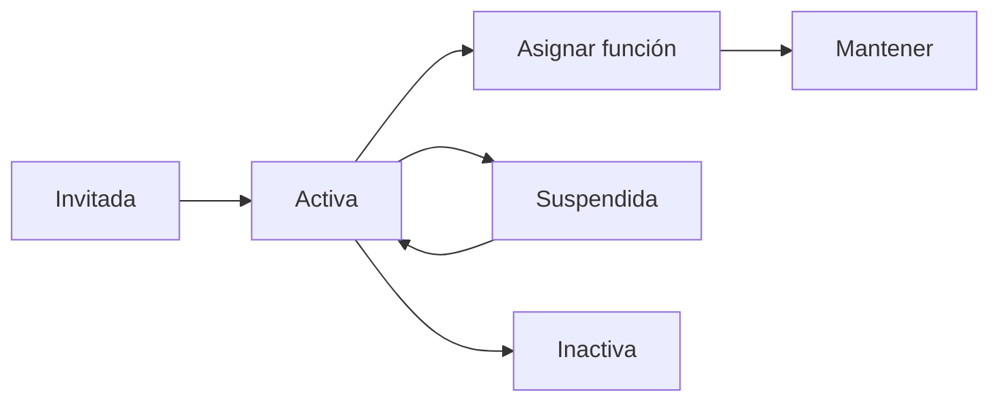

## Novedades

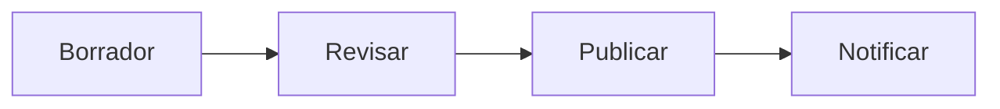

## Configuración

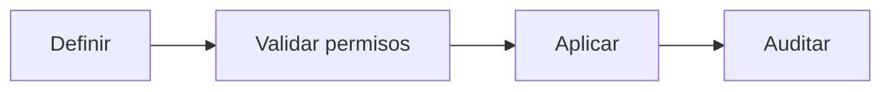

## Actualización incremental de datos ficticios

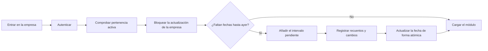
