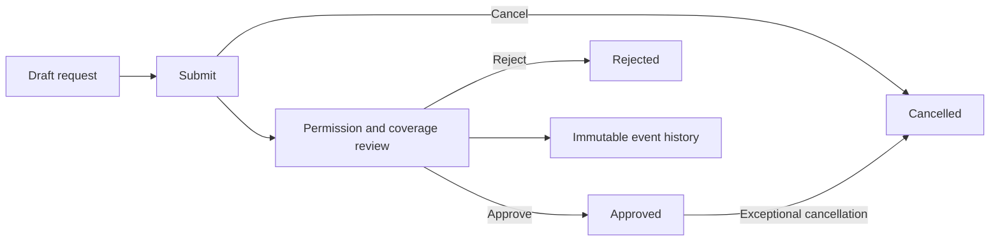
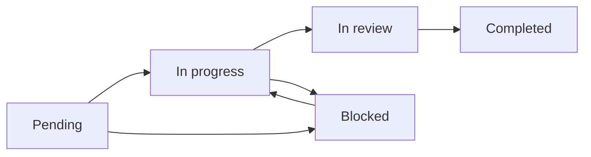
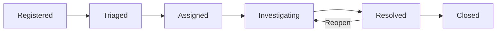
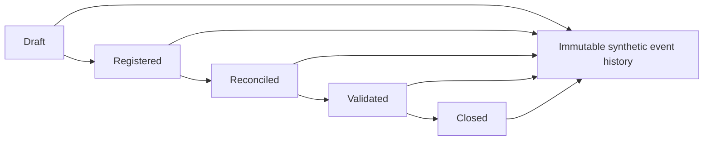
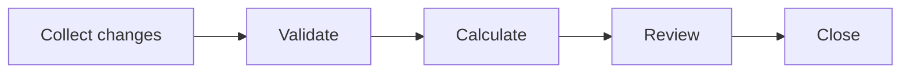
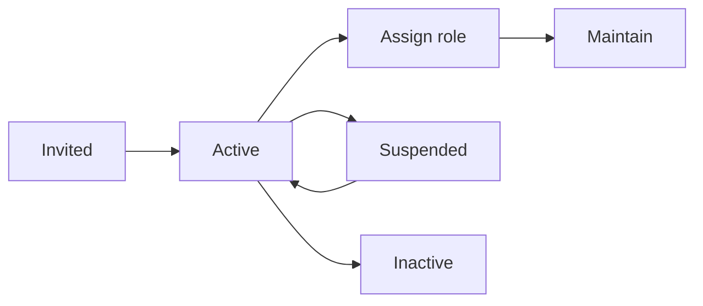
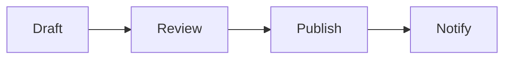
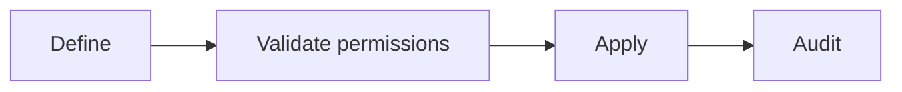
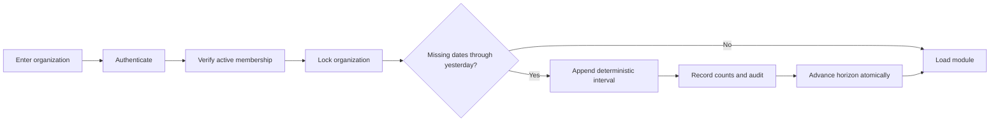

# Process maps

All maps describe the neutral demonstration, not internal employer workflows.

## Leave

## Tasks

## Incidents

## Treasury

## Payroll

Only collection-stage cycles can be edited. Every transition requires a
decision note and appends an immutable event. Values are synthetic aggregates;
individual payroll records remain outside the demo boundary.

## People

## Changelog

## Settings

## Incremental demo scenario

