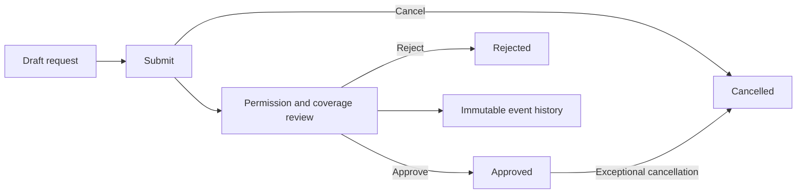
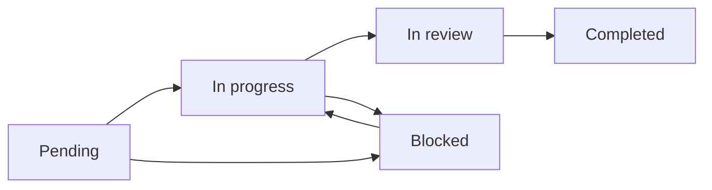
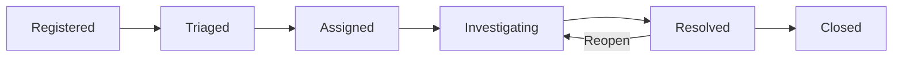
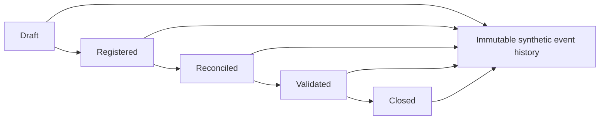
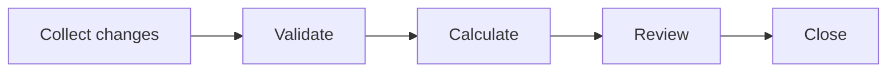
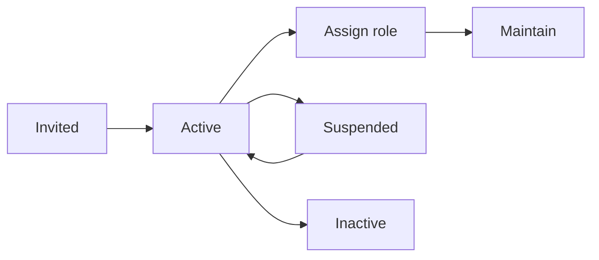
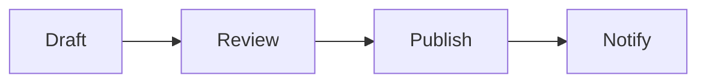
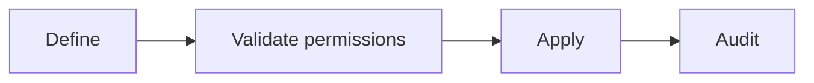
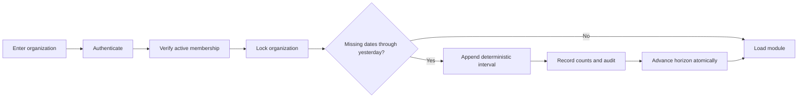

# Mapas de procesos

Todos los diagramas describen la demostración neutral, no procesos internos de
una organización real.

## Vacaciones

## Tareas

## Incidencias

## Tesorería

## Nóminas

Solo pueden editarse los ciclos que están en fase de recopilación. Cada
transición exige una nota de decisión y añade un evento inmutable. Los valores
son agregados ficticios; los registros individuales de nómina quedan fuera de
los límites de la demo.

## Personal

## Novedades

## Configuración

## Escenario incremental de demostración

