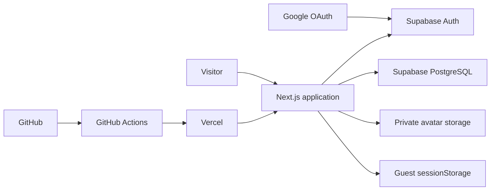
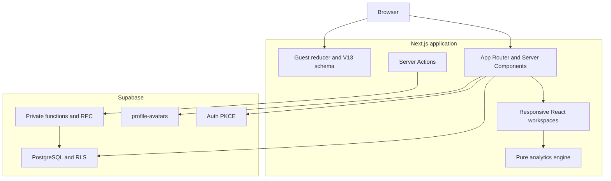
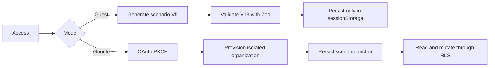
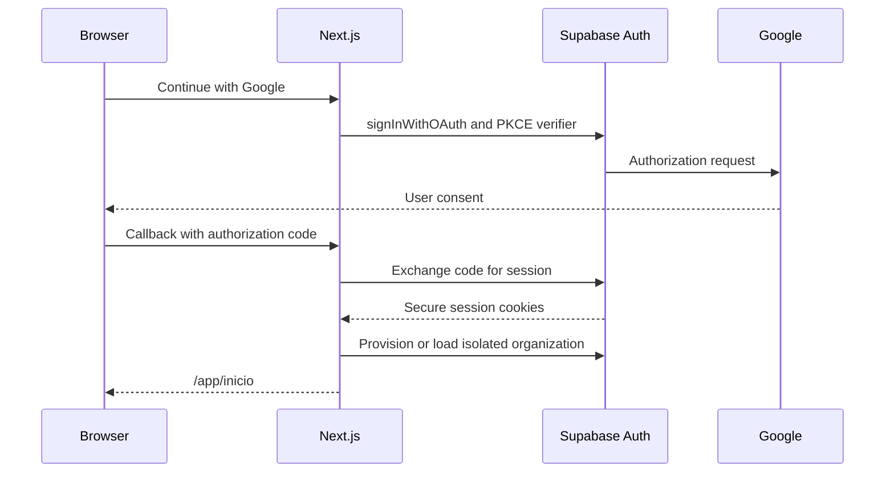
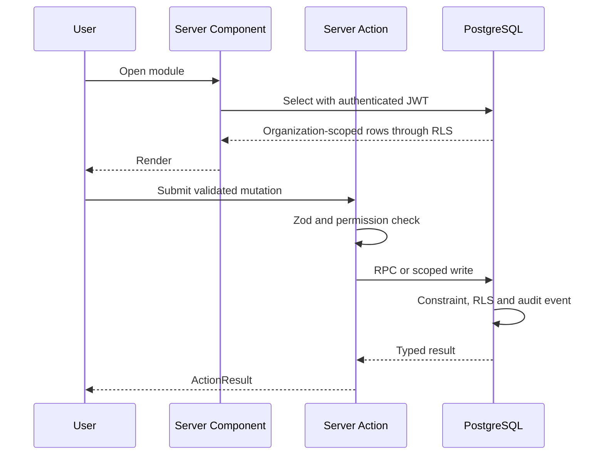
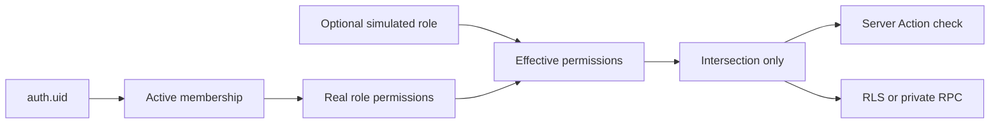
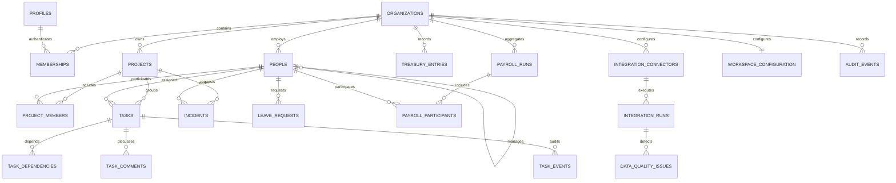
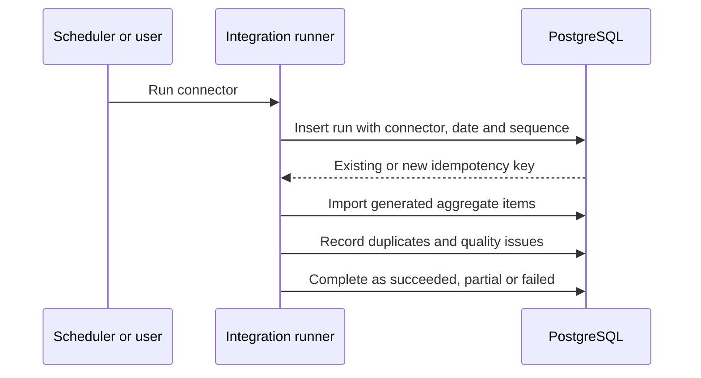

# Technical case study

## 1. Purpose and boundaries

This repository demonstrates a modular management SaaS using exclusively
fictitious data. It is an independent implementation and does not reproduce
third-party code, datasets, screens, brands, private structures or operating
procedures.

Functional requirements:

- public Google OAuth and a guest mode without an account;
- isolated organization data with role-based authorization and RLS;
- modules for Home, Leave, Analytics, Projects, Tasks, Incidents, Treasury,
  Payroll, People, Changelog and Settings;
- traceable state transitions and neutral integration simulations;
- responsive, keyboard-accessible UI;
- deterministic, restorable demo data.

Non-functional requirements:

- TypeScript contracts validated with Zod;
- no real identity, payroll, bank or employment records;
- reproducible local database, migrations and pgTAP checks;
- WCAG A/AA-oriented interactions and reduced motion support;
- production builds and releases through GitHub Actions and Vercel;
- no runtime paid dependency beyond the approved free-tier services.

## 2. Stack and languages

| Layer | Technology |
| --- | --- |
| Web | Next.js 16 App Router, React 19, TypeScript |
| UI | Tailwind CSS toolchain, CSS, Radix UI, Tabler Icons, Recharts, dnd-kit |
| Validation | Zod, Bun tests |
| Data | PostgreSQL, SQL migrations, Supabase Auth/Storage/RLS |
| Browser tests | Playwright, Axe |
| Delivery | Bun, GitHub Actions, Vercel |

## 3. System context



## 4. Containers and components



## 5. Guest and OAuth flows





## 6. Authenticated reads and mutations



`ActionResult` is a discriminated union: typed success or a controlled error
with a safe public code and message. Server Actions never return database
details or secrets.

## 7. Authorization and RLS



The simulator can only reduce privileges. Tables exposed through the API have
RLS enabled. Privileged functions use an empty `search_path`, revoke default
execution rights and explicitly verify identity, membership and permission.

## 8. Data model



Profiles contain authentication preferences; people contain fictitious
operational directory records; memberships join identity, organization and
role. Payroll participants only state inclusion and validation status. They
contain no individual monetary amount.

## 9. Integrations and idempotency



Connectors are neutral reconstructions. A unique key formed by connector,
effective date and source sequence prevents duplicate processing. No external
bank, payroll or people system is contacted.

## 10. Scenario lifecycle and analytics

Scenario V5 starts on `2025-01-01`. Guest sessions anchor to their first load.
Authenticated organizations persist `scenario_anchor_date` on creation or
explicit restoration. The anchor drives due dates, SLA, leave, treasury,
payroll, integrations and analytics, so existing fictitious changes do not
move with wall-clock time.

The guest analytics engine is pure and operates in memory. Authenticated
analytics uses organization-scoped aggregate queries/RPC with the same
contracts. `AnalyticsWindow` produces current and previous periods;
`AnalyticsSnapshot` contains KPIs, series, alerts, filters and update time.

## 11. Database controls

Migrations are append-only and cover:

1. base organizations, roles, memberships, audit and leave;
2. tasks, incidents, people, changelog, settings, treasury and payroll;
3. isolated public demo provisioning and lifecycle;
4. projects, profile self-service, integrations and analytics;
5. RLS/query hardening and avatar storage;
6. scenario V2, V3, V4 and V5 compatibility migrations.

Important constraints include organization foreign keys, valid state checks,
no self-managed person, acyclic task dependencies at domain/function level,
unique payroll participant per cycle/person and integration idempotency keys.
Indexes place organization first for scoped reads and add partial indexes for
active or unresolved records. `supabase db lint`, advisors and pgTAP validate
schema, policies, function privileges and cross-organization denial.

## 12. Security and privacy

- OAuth authorization code flow with PKCE and SSR cookies.
- RLS as the final database boundary.
- Private avatar bucket with owner-only paths and signed URLs.
- No service-role key in the browser.
- Guest mode never calls Supabase.
- Public-data CI detector blocks emails, bank identifiers, identity numbers,
  telephone patterns and prohibited third-party terms.
- CSP and iframe policy limit embedding to the configured origin.
- Logs and audit events use safe descriptions without secrets.

The legal pages describe technical processing and are not legal advice.

## 13. Accessibility, responsive and performance

Radix primitives supply focus management and keyboard semantics. All dialogs
use fixed headers/actions, scrollable bodies and `100dvh` limits. Charts have
equivalent tables. Motion honors `prefers-reduced-motion`. Responsive checks
cover 320, 360, 390, 768, 1024 and 1440 px. Lists are paginated, Kanban owns
its horizontal scroll, and authenticated analytics avoids downloading full
datasets.

## 14. Testing strategy

- domain: schemas, transitions, deterministic data, date windows and metrics;
- browser: OAuth entry, guest flows, persistence, dialogs, responsive and CSV;
- accessibility: Axe, keyboard, focus, contrast and reduced motion;
- database: schema, RLS, roles, function privileges, idempotency and isolation;
- delivery: lint, typecheck, unit tests, content/privacy validators, build,
  E2E, database reset/lint/advisors and `git diff --check`.

## 15. CI/CD

```mermaid
flowchart LR
  branch["Feature branch"] --> checks["Lint, typecheck, tests and build"]
  checks --> pr["Pull request"]
  pr --> preview["Vercel Preview"]
  preview --> qa["OAuth, RLS, accessibility and responsive QA"]
  qa --> merge["Merge reviewed commit"]
  merge --> production["Promote validated artifact"]
  production --> smoke["Production smoke test"]
  smoke --> tag["Git tag and GitHub Release"]
```



Remote migrations are reviewed locally, applied before dependent code is
promoted and never use credentials from the repository.

## 16. Local installation and operations

```powershell
bun install --frozen-lockfile
Copy-Item .env.example .env.local
bunx supabase start
bunx supabase db reset
bun run dev
```

Required public variables are documented in `.env.example`. Google provider
credentials are configured in Supabase Auth, not committed. Restore demo data
from Settings to update the anchor intentionally. Recovery consists of
reapplying append-only migrations, regenerating the deterministic scenario and
verifying the audit event.

## 17. Requirements traceability and chronology

| Phase | Outcome |
| --- | --- |
| Foundation | Independent Next.js/Supabase architecture and guest boundary |
| Leave | Date calculation, review transitions, calendar and audit |
| Tasks | Kanban, dependencies, comments and WIP |
| Incidents and People | SLA workflow, directory and availability |
| Treasury and Payroll | Aggregate, traceable financial flows |
| Projects and integrations | Cross-module planning and neutral automation |
| v1.0.0 | First stable OAuth/RLS demonstration |
| v1.1.0 | Profiles, visual system and analytics |
| v1.2.0 | Balanced scenario and dynamic metric windows |
| v1.2.1 | Responsive charts, dialogs and temporal consistency |
| v1.2.2 | Final OAuth, scenario V5, payroll participants and organization view |

The public Changelog owns editorial dates. Git and deployment systems retain
their actual technical timestamps.

## 18. Architectural decisions and rejected alternatives

- Two explicit repositories were selected over a shared client abstraction to
  guarantee that guest mode cannot accidentally contact Supabase.
- Deterministic generation was selected over live public SQL to avoid privacy,
  availability, licensing and reproducibility risks.
- Aggregated payroll was selected over fictitious individual salaries because
  individual compensation is unnecessary for the technical demonstration.
- Server Actions plus RLS were selected over browser writes so validation,
  authorization and audit remain centralized.
- Private uploads with local WebP processing were selected over paid image
  transformations.

Related records: `docs/adr`, `ARCHITECTURE.md`, `PERMISSIONS.md`,
`DATA-PROVENANCE.md`, `PROCESS-MAPS.md`, `DEPLOYMENT.md`, `SECURITY.md`.
