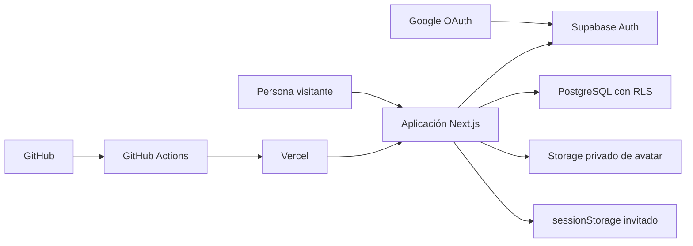
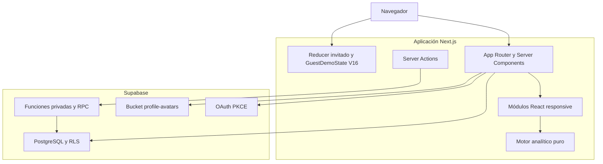
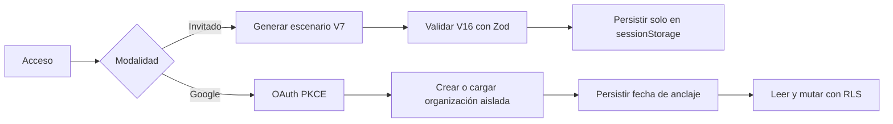
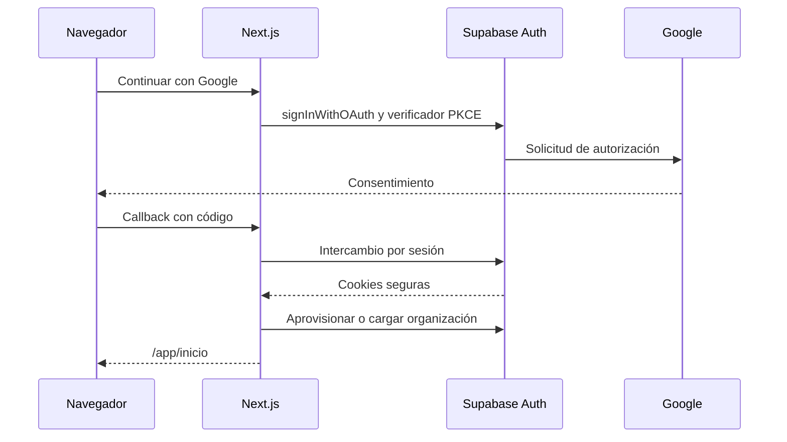
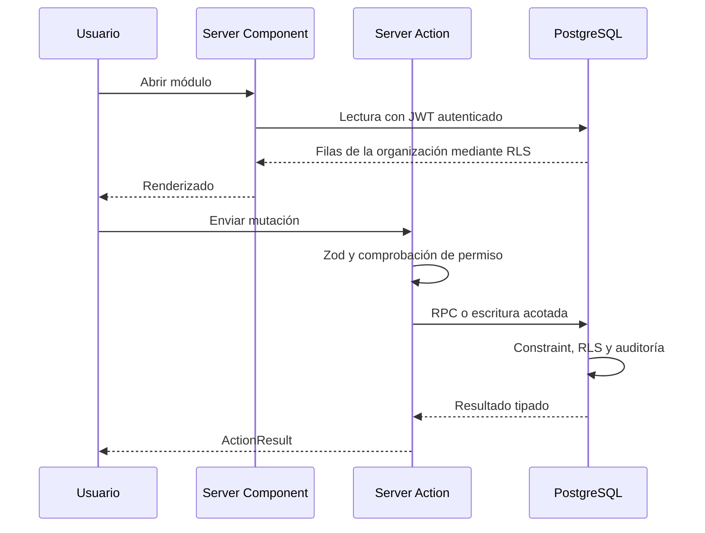
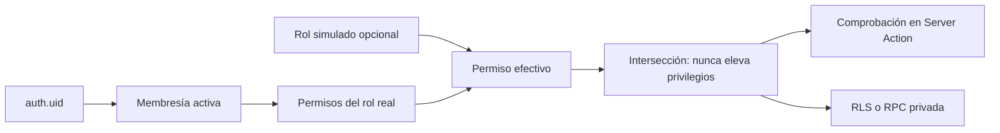
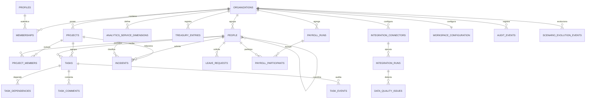
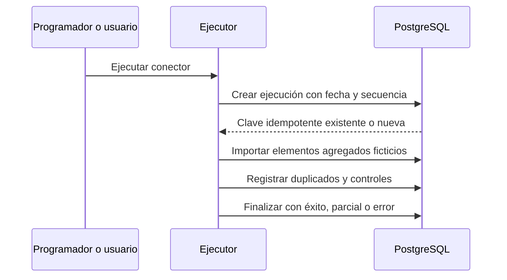
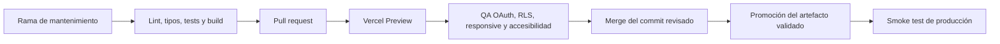

# Caso de estudio técnico

## English summary

This repository is an independent, full-stack demonstration of a modular
management platform. It combines a session-only guest experience with an
isolated OAuth workspace backed by PostgreSQL and Row Level Security. All
operational records are deterministic and fictitious; the project contains no
third-party internal code, datasets, screens, brands or procedures.

## 1. Objetivo, alcance y restricciones

La aplicación demuestra cómo organizar proyectos, tareas, vacaciones,
incidencias, tesorería, nóminas agregadas, personas, novedades, configuración
y analítica en una única interfaz. Se desarrolló como reconstrucción técnica
independiente y neutral.

Requisitos funcionales:

- acceso público mediante Google OAuth y modo invitado sin cuenta;
- espacio aislado por identidad, autorización por roles y RLS;
- trazabilidad inmutable de las transiciones operativas;
- simulación de integraciones neutrales e idempotentes;
- analítica filtrable con comparación entre periodos;
- restauración reproducible del escenario de demostración;
- interfaz responsive, accesible por teclado y compatible con movimiento
  reducido.

Requisitos no funcionales:

- contratos TypeScript validados con Zod;
- ausencia de identidades, cuentas bancarias, salarios individuales y
  documentos reales;
- base de datos reproducible mediante migraciones y pruebas pgTAP;
- validación continua de contenido, privacidad, accesibilidad y build;
- despliegues trazables mediante GitHub Actions y Vercel;
- uso exclusivo de servicios gratuitos previamente autorizados.

## 2. Stack y responsabilidades

| Capa | Tecnología | Responsabilidad |
| --- | --- | --- |
| Aplicación web | Next.js 16, React 19, TypeScript | Rutas, Server Components, Server Actions e interfaz |
| Presentación | Tailwind CSS, CSS, Radix UI, Tabler Icons | Diseño, accesibilidad, foco y componentes |
| Interacción | dnd-kit, Recharts | Kanban accesible y gráficos |
| Validación | Zod, Bun test | Contratos, dominio y pruebas unitarias |
| Datos | PostgreSQL, SQL, Supabase | Persistencia, Auth, Storage, RPC y RLS |
| Navegador | Playwright, Axe | Recorridos E2E, responsive y accesibilidad |
| Entrega | Bun, GitHub Actions, Vercel | Dependencias, CI, Preview y producción |

## 3. Contexto del sistema



## 4. Contenedores y componentes



## 5. Flujos invitado y OAuth





La modalidad invitada nunca consulta Supabase. Su estado se valida al
hidratarse y se conserva únicamente durante la sesión de la pestaña. La
modalidad OAuth mantiene una organización persistente por identidad.

## 6. Lecturas y mutaciones autenticadas



`ActionResult` es una unión discriminada: éxito tipado o error controlado con
código seguro y mensaje público. Las Server Actions no devuelven detalles de
base de datos, secretos ni trazas internas.

## 7. Autorización y RLS



Todas las tablas expuestas aplican RLS. Las funciones `SECURITY DEFINER`
revocan permisos por defecto, fijan un `search_path` seguro y verifican
explícitamente identidad, organización y permiso. La simulación de rol solo
puede reducir el acceso real.

## 8. Modelo de datos



`profiles` contiene preferencias de la identidad autenticada; `people`
contiene fichas profesionales ficticias; `memberships` une identidad,
organización y rol. `people.employment_contract_type` usa códigos estables y
denominaciones laborales públicas. Los participantes de nómina solo indican
inclusión y validación: nunca almacenan importes individuales.

## 9. Integraciones, idempotencia y recuperación



La clave formada por conector, fecha efectiva y secuencia de origen evita
duplicados. Los conectores son neutrales y no contactan bancos, asesorías ni
sistemas de personal reales. Los reintentos y errores se registran sin
credenciales ni payloads sensibles.

## 10. Escenario V7 y contratos

El escenario V7 comienza el `2025-01-01` y crece hasta ayer en
`Europe/Madrid`. La misma semilla y ancla producen el mismo checksum.
`GuestDemoState V16` conserva las entidades y preferencias de V15 y añade la
entrada editorial de v1.3.0 sin regenerar el escenario ni sobrescribir cambios
operativos. La migración V14 a V15 continúa anexando únicamente IDs
deterministas ausentes.

La corrección operativa final eleva de forma aditiva `scenario_version` a 7
cuando una organización ya estaba generada hasta ayer. Así se evita que la RPC
salga sin trabajo pendiente y conserve por error la marca histórica V6.

Distribución:

- 266 entidades de persona, 6 equipos y cuatro modalidades contractuales;
- 10 proyectos y 982 tareas con 85–90 % de histórico completado;
- 138 solicitudes de vacaciones y 65 incidencias;
- 396 movimientos de tesorería y 19 ciclos de nómina agregada;
- 76 ejecuciones de integraciones con resultados variables.

Reglas de dominio:

- un proyecto con todas sus tareas completadas pasa a `Completado`;
- un proyecto no completado mantiene trabajo abierto y un progreso máximo del
  99 %;
- las transiciones de tareas recalculan estado y progreso;
- dependencias de tareas sin autorreferencias ni ciclos;
- transiciones inválidas rechazadas en dominio, Server Action y SQL.

## 11. Analítica

`AnalyticsFilter` modela periodo, proyecto, equipo, responsable, estado y
servicio. `AnalyticsWindow` genera ventanas actual y anterior de igual
duración. `AnalyticsSnapshot` contiene KPIs, series, alertas estructuradas,
filtros y fecha de actualización.

El invitado calcula en memoria. OAuth usa consultas agregadas acotadas por
organización con el mismo contrato. Las definiciones públicas explican qué
representa cada métrica, cómo interpretarla, su fuente funcional y su
frecuencia, sin exponer tablas ni códigos internos. Los formatos compartidos
distinguen recuentos, porcentajes, duraciones y moneda.

## 12. Migraciones, índices y constraints

Las migraciones append-only cubren:

1. organizaciones, roles, membresías, auditoría y vacaciones;
2. tareas, incidencias, personas, novedades, configuración, tesorería y
   nóminas;
3. aprovisionamiento y ciclo de vida del escenario público;
4. proyectos, perfil, integraciones y analítica;
5. endurecimiento de RLS, consultas y Storage privado;
6. compatibilidad de escenarios V2 a V7 y GuestDemoState hasta V16;
7. dimensiones estables de servicio y auditoría de evolución incremental.

Los índices priorizan `organization_id` en lecturas acotadas y añaden índices
parciales para registros activos. Los constraints verifican estados,
relaciones organizativas, participantes únicos, claves idempotentes, modalidad
contractual y coherencia proyecto–tareas. pgTAP cubre esquema, privilegios,
RLS, aislamiento y funciones de restauración.

## 13. Seguridad, privacidad y propiedad

- OAuth authorization code con PKCE y cookies SSR.
- RLS como barrera final de datos.
- Bucket privado de avatar con rutas por propietario y URLs firmadas.
- Ninguna service-role key llega al navegador.
- Invitado sin llamadas a Supabase.
- Detector CI de correos, identificadores financieros, documentos, teléfonos
  y términos de proveedores reales.
- CSP, framing, referrer policy y cabeceras de seguridad.
- Licencia propietaria del repositorio e inventario separado de dependencias.

Las páginas de Privacidad, Procedencia y Aviso legal describen el tratamiento
técnico, el origen ficticio de los datos y la titularidad del software.

## 14. Accesibilidad, responsive y rendimiento

Radix aporta gestión de foco y semántica de teclado. Los diálogos mantienen
cabecera y acciones fijas, cuerpo desplazable y límites basados en `100dvh`.
Cada gráfico tiene tabla equivalente. El movimiento respeta
`prefers-reduced-motion`.

La validación cubre 320, 360, 390, 768, 1024 y 1440 px. Las listas usan
paginación, el Kanban limita su desplazamiento a su propio panel y las
consultas autenticadas de Analítica evitan descargar conjuntos completos.

## 15. Estrategia de pruebas

- dominio: schemas, transiciones, determinismo, fechas, proyectos y métricas;
- navegador: acceso, invitado, persistencia, diálogos, filtros y CSV;
- accesibilidad: Axe, teclado, foco, contraste y movimiento reducido;
- base de datos: RLS, roles, funciones, idempotencia y aislamiento;
- entrega: lint, typecheck, tests, validadores, build, E2E, reset, pgTAP,
  linter, advisors y `git diff --check`.

## 16. CI/CD



Las migraciones remotas se revisan y validan localmente antes de aplicarse. El
repositorio no contiene credenciales.

## 17. Instalación y operación local

```powershell
bun install --frozen-lockfile
Copy-Item .env.example .env.local
bunx supabase start
bunx supabase db reset
bun run dev
```

Las variables públicas se documentan en `.env.example`. Las credenciales del
proveedor Google se configuran en Supabase Auth. Restaurar datos desde
Configuración actualiza de forma explícita el ancla y registra la operación.

## 18. Trazabilidad por hitos

| Hito | Resultado |
| --- | --- |
| Requisitos y base | Arquitectura independiente, límites de datos y CI |
| Vacaciones | Cálculo, revisión, calendario y auditoría |
| Tareas | Kanban, dependencias, comentarios y WIP |
| Incidencias y Personal | SLA, directorio, disponibilidad, equipos cerrados y organigrama |
| Tesorería y Nóminas | Flujos agregados, conciliación y controles |
| Proyectos e integraciones | Planificación transversal y automatización neutral |
| v1.0.0 | Primera demostración estable con OAuth y RLS |
| v1.1.0 | Perfil, sistema visual y Analítica |
| v1.2.0 | Escenario equilibrado y ventanas dinámicas |
| v1.2.1 | Gráficos, diálogos y consistencia temporal |
| v1.2.2 | OAuth final, V5, participantes y organigrama |
| Mantenimiento v1.2.2 | V6, contratos, tareas, proyectos y documentación |
| v1.3.0 | Tema completo, V7 incremental, contratos analíticos, equipos cerrados y seguridad |
| v1.3.1 | Tareas móviles, backfill V7 aditivo, rate limiting, CSP y escaneo de secretos |
| v1.3.2 | Nombres naturales compartidos, Novedades orientadas a usuarios y migración idempotente |

Las fechas editoriales se muestran en Novedades; v1.3.0 utiliza el 23 de junio
de 2026, v1.3.1 el 29 de julio de 2026 y v1.3.2 el 30 de julio de 2026. Git,
PostgreSQL y Vercel conservan sus timestamps técnicos reales.

El tema claro es el valor inicial y el modo oscuro se activa manualmente desde
Perfil. La compatibilidad migra cualquier preferencia histórica `system` a
`light`, sin depender de cambios del sistema operativo.

## 19. Decisiones arquitectónicas

- Dos repositorios de datos explícitos evitan que el invitado contacte
  accidentalmente Supabase.
- La generación determinista sustituye SQL público en vivo para proteger
  privacidad, disponibilidad, licencias y reproducibilidad.
- La nómina agregada evita modelar compensaciones individuales innecesarias.
- Server Actions más RLS centralizan validación, autorización y auditoría.
- Las subidas privadas se procesan en WebP en cliente sin transformaciones de
  pago.

Documentos relacionados: [Arquitectura](./ARCHITECTURE.md),
[Permisos](./PERMISSIONS.md), [Procedencia](./DATA-PROVENANCE.md),
[Procesos](./PROCESS-MAPS.md), [Despliegue](./DEPLOYMENT.md),
[Seguridad](../SECURITY.md) y [decisiones ADR](./adr/).
